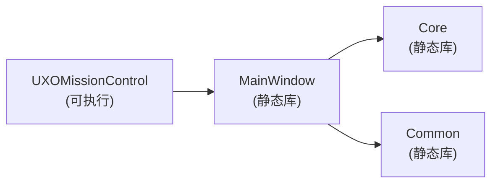
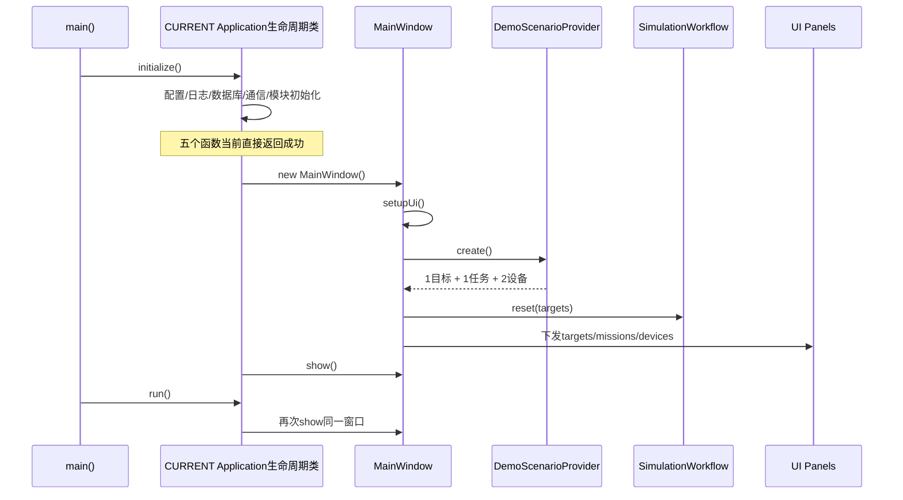
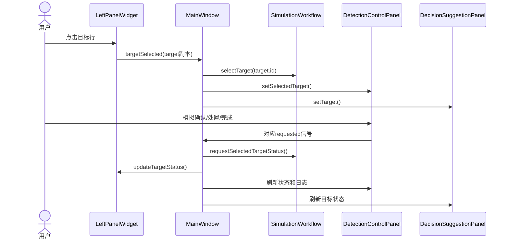
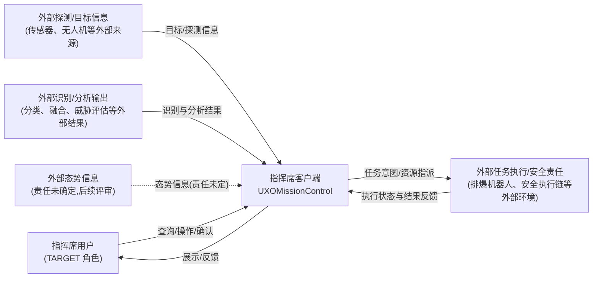
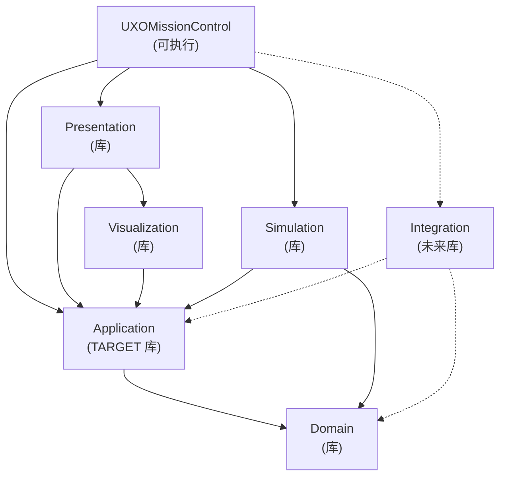
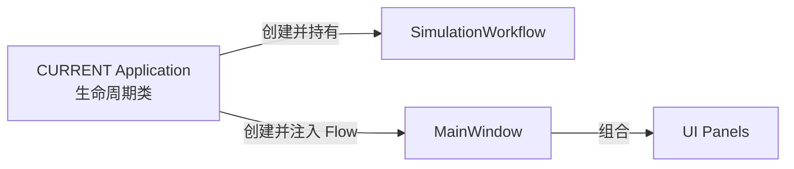

# 指挥席客户端软件架构

版本：V0.4 草稿
状态：待评审

## 1. 文档作用与阅读导航

本文档同时承载三层架构内容：

- **TARGET**：长期产品方向，来源于 `PRODUCT.md` 第 5 节的产品意图和第 11 节已确认决策；除明确确认的产品边界外，其余内容仍待评审，不代表已实现或已批准合同。
- **CURRENT**：当前实现事实，来源于源码、CMake 和测试，描述系统现在如何构建与运行。
- **NEXT**：已确认产品边界但尚未批准实施的候选架构草案，来源于 `PRODUCT.md` 第 9 节中状态为 `Draft` 的 REQ-001 至 REQ-006；需通过架构与 UI 设计评审并获用户批准后才能进入实现计划。

CURRENT 与 TARGET 不一致只表示架构缺口，不能通过修改需求迁就代码；只有关联需求和功能设计均为 `Approved` 后，缺口才能进入整改计划。NEXT 草案在批准前不得直接指导实现。

阅读导航：CURRENT 构建与边界见第 2-6 节；长期 TARGET 客户端上下文与构建模块见第 7-8 节；NEXT 候选架构（Draft）见第 9 节；演进映射与架构差距见第 10 节。UI 控件与交互行为见 [UI.md](./UI.md)；构建与质量门禁见 [DEVELOPMENT.md](./DEVELOPMENT.md)；产品边界与需求 ID 见 [PRODUCT.md](./PRODUCT.md)；安全边界见 [AGENTS.md](../AGENTS.md)。

## 2. CURRENT 工程概览与构建目标

当前是单进程 Qt 桌面应用：`MainWindow` 组合界面并承担大部分协调；`Core` 提供本地模拟、目标状态机和部分 3D 支持；所有状态在内存中，无外部集成或持久化。

下图的箭头表示 CMake 链接依赖（A -> B 表示 A 链接 B）。Qt 是外部依赖，测试目标、配置和文件不是生产模块，均不画入。



| 构建目标 | 源码位置 | 当前责任 | 直接项目依赖 |
|----------|----------|----------|--------------|
| `UXOMissionControl` | `src/App/`、`include/App/` | `main.cpp`、CURRENT `Application` 生命周期类与窗口创建 | `MainWindow` |
| `MainWindow` | `src/MainWindow/`、`include/MainWindow/` | 15 个 UI 源文件、面板、态势视图、状态栏、导航；承担 UI 组合与大部分协调 | `Common`、`Core` |
| `Core` | `src/Core/`、`include/Core/` | AirportData、AirportSceneFactory、DemoScenarioProvider、SimulationWorkflow | 无项目依赖 |
| `Common` | `src/Common/`、`include/Common/` | GlobalStyle（UI 样式）、MockDataGenerator（无当前调用方） | 无项目依赖（注：`Core` 不链接 `Common`；`Common` 通过公共头文件目录引用 `Core/Data/Types.h`，构成隐藏依赖） |

外部依赖：根 CMake 查找 `Qt5::Network` 与 `Qt5::Sql`，但无生产目标链接使用；ZeroMQ、PostgreSQL 只做可选探测；当前没有 MQTT 依赖。根 CMake 另定义 4 个测试目标，测试范围见 [DEVELOPMENT.md](./DEVELOPMENT.md) 第 4 节。

## 3. CURRENT 启动与对象装配



装配事实：

- CURRENT `Application` 生命周期类创建 `MainWindow` 并负责显示。
- `MainWindow` 创建并按值拥有 `SimulationWorkflow`。
- `DemoScenarioProvider` 只提供初始模拟数据，不参与运行时状态。
- CURRENT `Application` 生命周期类的五个初始化函数（配置/日志/数据库/通信/模块）当前直接返回成功。
- 配置文件和外部依赖没有进入装配流程。

## 4. CURRENT 状态所有权

```text
MainWindow
├── m_missions（任务，静态）
├── m_devices（设备，静态）
└── SimulationWorkflow（按值持有）
    ├── targets（目标）
    ├── 当前选择
    └── logEntries（操作日志）

AlertPanel（自身告警展示数据）
StatusBarWidget（自身告警展示数据）
```

| 状态 | 当前权威位置 | 复制/展示位置 | 问题 |
|------|--------------|--------------|------|
| 目标、当前选择、操作日志 | `SimulationWorkflow` | LeftPanel、DecisionPanel、SituationView、DetectionControlPanel 日志 | 需 MainWindow 手工同步到各 UI |
| 任务 | `MainWindow::m_missions` | LeftPanel、DecisionPanel | 静态，不随目标处置变化 |
| 设备 | `MainWindow::m_devices` | LeftPanel、DeviceStatusPanel、StatusBar | 静态，不随任务变化 |
| 告警展示数据 | `AlertPanel` 与 `StatusBarWidget` 各自保存 | 两套 UI | 启动时注入，无统一告警状态 |

## 5. CURRENT 已验证操作调用链

下图为当前唯一经自动测试与 UI 契约测试验证的完整操作路径。



导航、任务选择、设备选择、批量操作、紧急停止和 3D 目标点击没有形成等价的完整消费链。

## 6. CURRENT 结构问题

| 结构问题 | 影响 |
|----------|------|
| `MainWindow` 混合 UI 与应用编排并持有任务/设备状态副本 | 状态分散，UI 与编排耦合 |
| `Core` 混合领域模型、模拟场景与 Qt3D 渲染 | 领域与渲染耦合，难以独立演进 |
| `Common` 混合 UI 样式与未使用的模拟数据生成，且对 `Core/Data/Types.h` 存在隐藏头文件依赖 | 责任混杂，依赖不透明 |
| `UXOMissionControl` 是启动外壳，初始化为占位 | 无真实配置、日志、装配 |
| 状态权威分散在 `SimulationWorkflow`、`MainWindow` 与 UI 面板 | 跨面板不一致，手工同步易错 |
| 根 CMake 查找 `Qt5::Network`、`Qt5::Sql`、ZeroMQ、PostgreSQL 但无生产目标使用 | 误导存在外部集成 |
| 外部数据边界未开始 | 无网络、存储、设备或服务适配器 |

各问题的长期归属集中见第 10.1 节，避免在两处维护同一迁移决定。

## 7. 长期 TARGET 客户端上下文

长期 TARGET 描述客户端与外部环境之间的责任边界，不指定协议、端口、数据库、厂商或部署形态。箭头表示概念性的信息、结果或任务意图流向；虚线表示责任仍未确定。真实校验与执行始终位于客户端之外。本节内容属于长期方向，不是当前实现，也不是已批准接口合同。



边界说明（依据 `PRODUCT.md` 第 5 节）：

- 外部探测、识别和分析结果进入客户端，客户端负责呈现和业务编排。
- 客户端只向外部安全执行责任提交任务意图，并接收执行状态与结果；不直接控制设备。
- 外部态势、历史/审计和持久化责任尚未确定，留待后续需求与设计评审。

上述关系不构成已批准接口合同。客户端不执行真实排爆动作、不写入真实数据库或外部系统，未来任何外部接入须经过单独评审和授权（见 [PRODUCT.md](./PRODUCT.md) §5.5、§5.6 与 [AGENTS.md](../AGENTS.md)）。

## 8. TARGET 项目模块与构建依赖

本节是长期责任架构，描述客户端的逻辑分层与构建依赖方向，不是 CURRENT 实现，也不是已批准的接口设计。箭头语义：实线箭头表示编译/链接依赖（A -> B 表示 A 依赖 B）；虚线箭头表示未来或未批准的外部集成。本图只表达编译/链接依赖，不表达状态、数据或通知流。



| 架构构件 | 架构职责 | 依赖约束 |
|----------|----------|----------|
| `UXOMissionControl` 可执行 | 组合根、进程生命周期、配置与日志初始化 | 不含业务规则；依赖 Presentation、Application、Simulation 与未来 Integration |
| `Presentation` 库 | Qt Widgets 外壳、页面、面板 | 不含权威业务状态；不直接访问外部系统；依赖 Application 与 Visualization |
| `Visualization` 库 | Qt3D、视频、地图渲染 | 不含业务状态；不访问外部系统；依赖 Application |
| TARGET `Application` 库 | 用例、命令/查询、会话与工作流编排、适配接口 | 只依赖 Domain；不含 Qt Widgets、Qt3D、Network、Sql 或外部 SDK |
| `Domain` 库 | 目标/任务/设备模型、状态机、业务规则 | 不依赖 Qt Widgets、Qt3D、Network、Sql、外部 SDK 或任何上层 |
| `Simulation` 库 | 本地场景与 TARGET Application 适配接口的实现 | 依赖 Application 与 Domain；可使用 Domain 类型，但不得绕过 Application 修改权威状态；永不接入真实外部系统 |
| `Integration` 库（未来） | 外部信息/识别/执行反馈/历史的适配 | 依赖 Application 与 Domain；可使用 Domain 类型，但命令和状态修改必须经过 Application；无 UI、无直接硬件/设备控制；仅在批准需求后引入 |

模块按需增量引入：仅当批准的工作需要时才创建对应目标与目录，不预先创建空目标或空目录以匹配本图。不新增通用 Repository、Store、服务容器或事件总线。

## 9. NEXT 候选架构（Draft）

NEXT 是已确认产品边界但尚未批准实施的草案，全部对应 `PRODUCT.md` 第 9 节中状态为 `Draft` 的 REQ-001 至 REQ-006。NEXT 必须先通过架构与 UI 设计评审并获用户批准，才能进入实现计划；本节为候选架构责任，不等于已批准实施。NEXT 是从 CURRENT 向长期 TARGET 演进的首个迁移切片，不是长期目标本身。

### 9.1 需求到架构责任映射

`PRODUCT.md` 统一管理需求 ID、验收结果与状态；本文档只映射由需求推导出的架构责任，不创建或重编号需求，不复制验收标准，不改变需求状态。

| 产品需求引用（PRODUCT §9.2，Draft） | 架构责任/约束（非验收标准） |
|----------|----------|
| REQ-001 统一模拟会话状态 | 一个业务对象统一拥有目标、任务、设备、选择和日志 |
| REQ-002 模拟设备指派 | 命令为已选目标对应的待执行模拟任务指派设备，并原子校验目标、任务和设备可用性 |
| REQ-003 模拟任务执行 | 状态机必须同时维护目标、任务和设备状态 |
| REQ-004 跨面板一致反馈 | UI 只能查询权威状态，不能维护独立业务副本 |
| REQ-005 可复现场景 | 场景提供器只构造初始数据，不成为运行时状态所有者 |
| REQ-006 完整操作记录 | 所有成功和拒绝命令进入同一进程内日志 |

### 9.2 NEXT 候选组件架构

下图只表达对象创建、注入和 UI 组合关系，不表达命令、状态或通知流。



NEXT 候选设计规则：

- CURRENT `Application` 生命周期类创建并持有 `SimulationWorkflow`，再注入 `MainWindow`。
- `DemoScenarioProvider` 只构造初始场景并交给 `SimulationWorkflow` 加载，不成为运行时状态所有者。
- `SimulationWorkflow` 统一拥有目标、任务、设备、当前选择和操作日志。
- 命令同步返回成功/失败及原因；非法命令不得产生部分状态修改。
- 状态变化发出统一 Qt 通知，MainWindow 回查权威状态后刷新 UI。
- Panel 只保存选中索引、折叠状态等 UI 状态，不保存可独立修改的业务状态。
- 不新增通用 Repository、Store、服务容器、事件总线或预留外部接口。

候选类名为现有实现事实，仅属于 NEXT 迁移切片；长期 TARGET 模块划分见第 8 节，NEXT 评审通过后是否向 TARGET 模块对齐由批准后的功能设计决定。

## 10. 演进关系与架构差距

### 10.1 CURRENT 到 TARGET 的模块映射

| CURRENT 模块 | 长期 TARGET 归属 | 演进说明 |
|--------------|------------------|----------|
| `UXOMissionControl` | `UXOMissionControl` 可执行 | 保留为组合根，但接收真实装配责任（配置/日志/初始化） |
| `MainWindow` | `Presentation` + TARGET `Application` 编排 | UI 部分归 Presentation；应用编排与状态副本归 TARGET Application |
| `Core` | `Domain` + TARGET `Application` + `Simulation` + `Visualization` | 领域模型归 Domain；工作流编排归 TARGET Application；场景提供器归 Simulation；Qt3D 渲染归 Visualization |
| `Common` | 消除为通用目标 | `GlobalStyle` 归 Presentation；`MockDataGenerator` 归 Simulation 或在无用时移除 |

### 10.2 NEXT 组件到长期 TARGET 的归属

| NEXT 候选组件 | 长期 TARGET 归属 | 说明 |
|---------------|------------------|------|
| CURRENT `Application` 生命周期类 | `UXOMissionControl` 可执行/组合根 | 保留生命周期与装配责任，不等同于 TARGET Application 库 |
| `SimulationWorkflow` | TARGET `Application` + `Domain` | 当前候选实现同时承担编排、状态与规则，是过渡组件，不等同于最终模块 |
| `DemoScenarioProvider` | `Simulation` | 只提供本地初始场景和模拟数据 |
| `MainWindow`、UI Panels | `Presentation`；渲染相关部分归 `Visualization` | UI 组合与渲染边界分离，业务编排不留在 UI |

### 10.3 CURRENT 到 NEXT 的差距

| 差距 | CURRENT | NEXT 候选（Draft） |
|------|---------|--------|
| Workflow 所有权 | MainWindow 按值持有 | CURRENT `Application` 生命周期类创建并注入 |
| 会话状态 | 目标在 Workflow；任务/设备在 MainWindow | 全部在 SimulationWorkflow |
| UI 更新 | MainWindow 分别调用多个 setter | 统一 change 通知后回查刷新 |
| 业务命令 | MainWindow 拼接调用 | Workflow 原子处理并返回结果 |
| 任务/设备状态机 | 不存在 | 支持指派、执行、完成和拒绝路径 |
| 页面导航 | 只改变高亮 | 页面路由行为由 UI 设计确定并实现 |

### 10.4 NEXT 到长期 TARGET 的差距

下表只列出 `PRODUCT.md` 已支持的长期缺口；每项均需后续需求或设计评审，不属于已承诺工作。

| 长期 TARGET 缺口 | NEXT 草案范围 | 后续归属 |
|------------------|----------------|----------|
| 外部信息接入 | 不包含；NEXT 仅本地模拟数据 | 需求与设计评审，外部接入须单独授权 |
| 长期决策支持 | 不包含；NEXT 仅维护状态一致性 | 后续需求与算法/规则设计评审 |
| 外部执行反馈边界 | 不包含；NEXT 不接外部执行 | 外部安全执行评审，须单独授权 |
| 历史/持久化边界 | 不包含；NEXT 仅内存日志 | 持久化与回放设计评审，责任未定 |
| 用户/权限模型 | 不包含；NEXT 单一指挥席用户 | 角色与权限设计评审 |

实现步骤属于 `.omo/plans/`，不写入本架构基线。
