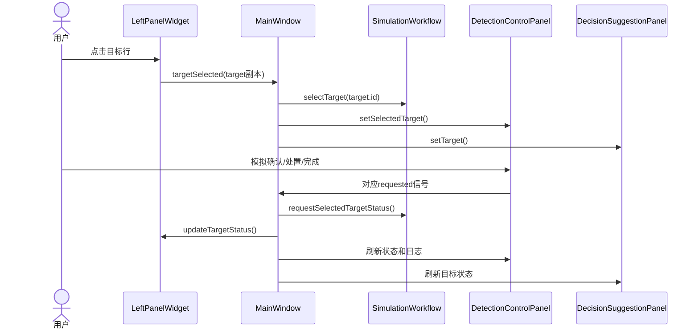
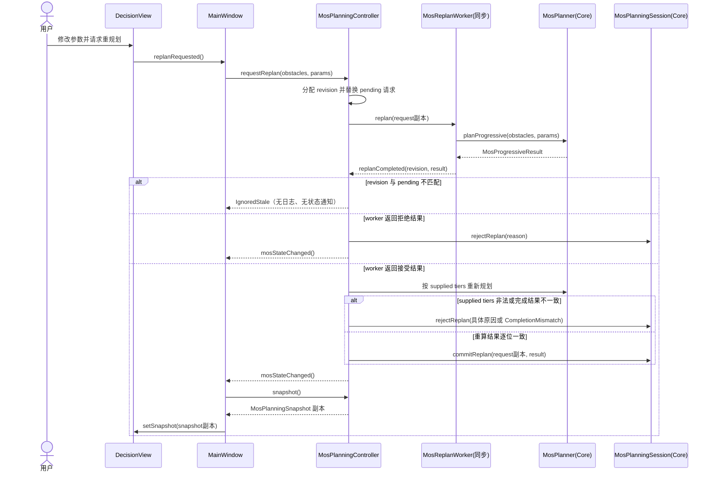

# CURRENT 已验证操作调用链

> 本文从 [ARCHITECTURE.md](../ARCHITECTURE.md) 第 5 节迁出，是 CURRENT 实现细节子文档。描述经自动测试与 UI 契约测试验证的操作路径。

下图为当前经自动测试与 UI 契约测试验证的两条完整操作路径：目标处置链（原有）与 MOS 重规划链（新增）。

## 1. 目标处置链

## 2. MOS 重规划链

通知语义事实：

- 控制器接受提交或拒绝日志落盘后发出无载荷 `mosStateChanged()`；`MainWindow` 随后调用 `snapshot()` 拉取按值副本并交给 `DecisionView::setSnapshot`。陈旧或重复完成返回 `IgnoredStale`，不发状态通知。
- `MosPlanningSnapshot` 按值复制 fixture、params、result、selectedTier、committedRevision 与 sequencedLog；`DecisionView` 不持有控制器或会话指针，无法回写。
- revision guard 完全同步：controller 在请求时分配单调 revision 并保存 pending 请求；只有完成 revision 与 pending 相等才可进入重算/提交，陈旧或重复完成直接忽略。worker 不写 session，controller 对接受结果按 supplied tiers 重算并逐位比对后才提交。当前实现不引入生产 `QThread`；若未来线程化必须保留同一 guard 与重算边界。
- 合法无解是接受结果：复合结果仍提交，具体 tier 以 `rectangle.valid=false` 与 `NoFeasibleRectangle` 表示；它不是 `IgnoredStale`。
- 导出链为 `MosGeneratorDialog` 请求 -> `DecisionView::exportRequested` -> `MainWindow` -> `MosPlanningController::exportFixture`。仅 controller 使用 `QSaveFile` 写出当前已提交障碍物的 canonical bytes；导出不改业务状态、revision、日志或通知计数，也无导入、网络或数据库路径。

导航、任务选择、设备选择、批量操作、紧急停止和 3D 目标点击没有形成等价的完整消费链。
