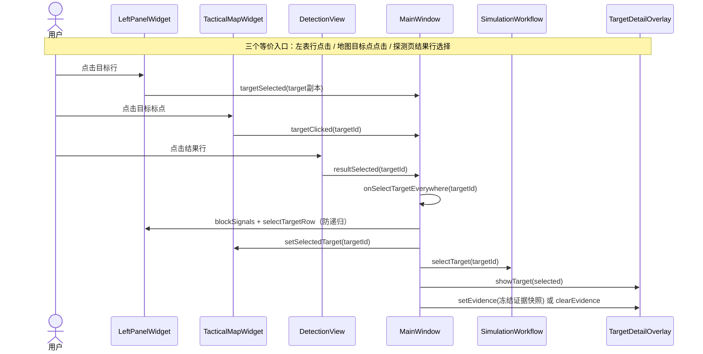
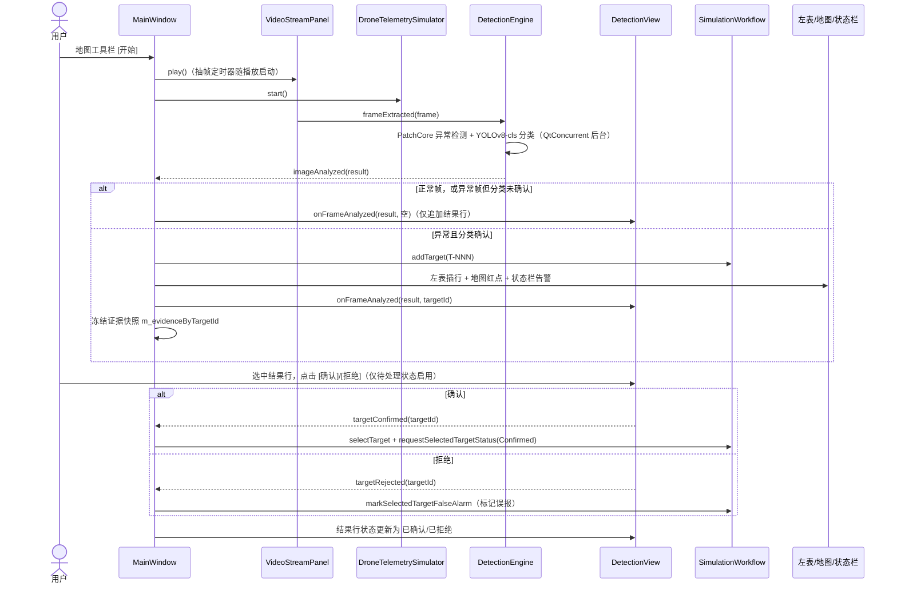
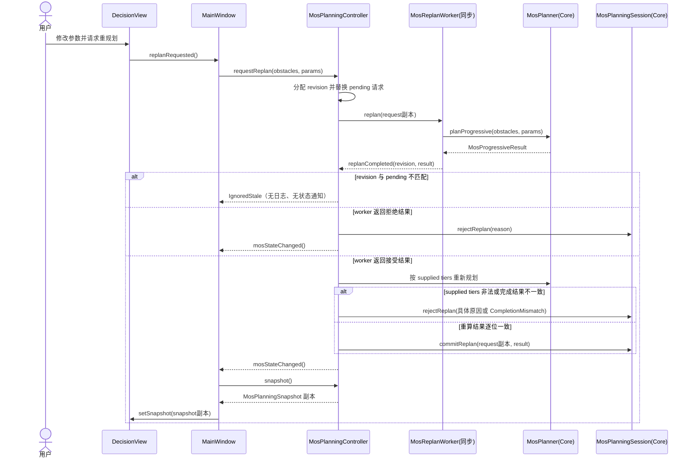

# CURRENT 已验证操作调用链

> 本文从 [ARCHITECTURE.md](../ARCHITECTURE.md) 第 5 节迁出，是 CURRENT 实现细节子文档。描述经自动测试与 UI 契约测试验证的操作路径。

下图为当前验证的三条完整操作路径：目标三向选择联动链、AI 检测与人工校验链、MOS 重规划链。三向联动链经自动测试覆盖（`simulation_workflow_ui` 验证目标表与 2D 战术地图双向高亮，`stop_select_flicker_repro` 为事件风暴调试复现）；AI 检测与人工校验链暂无自动化测试，经实际运行冒烟验证（见 [features/detection-onnx-integration.md](../features/detection-onnx-integration.md)）；MOS 重规划链经自动测试与 UI 契约测试验证。

## 1. 目标三向选择联动链

事实补充：

- 探测页结果行选择同时驱动 `DetectionView::displayRecord` 更新证据查看器、分类 Top-3、详情字段、热力图与状态时间线；`DetectionView` 只作为联动入口发出 `resultSelected`，不接收联动链回写。
- 证据快照在 AI 分析产出目标时冻结于 `MainWindow::m_evidenceByTargetId`（AI 红框标注图，无则回退热力图叠加图）。
- 未编译基线面板（`DetectionControlPanel`、`DecisionSuggestionPanel` 等，见 `UI.md`）不在本链中。

## 2. AI 检测与人工校验链

事实补充：

- 引擎在 `setupUi` 末尾 `initialize` 加载 ONNX 模型（`patchcore_512.onnx`/`yolov8_cls_224.onnx`/`patchcore_params.json`，路径经 `DETECTION_ASSETS_DIR` 注入）；失败经 `error` 信号在状态栏告警 `[AI] 检测引擎错误: ...`，不阻断启动。
- 地图工具栏 [结束] 停止视频与遥测并回 0s；[重置] 额外清空目标、航迹、探测页结果与证据快照。
- 目标处置状态机的处置中/完成（`Disposing`/`Disposed`）无 UI 入口，仅 `SimulationWorkflow` API 可达。
- 本链暂无自动化测试，冒烟验证记录见 [features/detection-onnx-integration.md](../features/detection-onnx-integration.md)。

## 3. MOS 重规划链

通知语义事实：

- 控制器接受提交或拒绝日志落盘后发出无载荷 `mosStateChanged()`；`MainWindow` 随后调用 `snapshot()` 拉取按值副本并交给 `DecisionView::setSnapshot`。陈旧或重复完成返回 `IgnoredStale`，不发状态通知。
- `MosPlanningSnapshot` 按值复制 fixture、params、result、selectedTier、committedRevision 与 sequencedLog；`DecisionView` 不持有控制器或会话指针，无法回写。
- revision guard 完全同步：controller 在请求时分配单调 revision 并保存 pending 请求；只有完成 revision 与 pending 相等才可进入重算/提交，陈旧或重复完成直接忽略。worker 不写 session，controller 对接受结果按 supplied tiers 重算并逐位比对后才提交。当前实现不引入生产 `QThread`；若未来线程化必须保留同一 guard 与重算边界。
- 合法无解是接受结果：复合结果仍提交，具体 tier 以 `rectangle.valid=false` 与 `NoFeasibleRectangle` 表示；它不是 `IgnoredStale`。
- 导出链为 `MosGeneratorDialog` 请求 -> `DecisionView::exportRequested` -> `MainWindow` -> `MosPlanningController::exportFixture`。仅 controller 使用 `QSaveFile` 写出当前已提交障碍物的 canonical bytes；导出不改业务状态、revision、日志或通知计数，也无导入、网络或数据库路径。

导航仅实现页面栈路由（见 [startup.md](./startup.md)）；任务选择、设备选择、批量操作与紧急停止没有形成等价的完整消费链。
