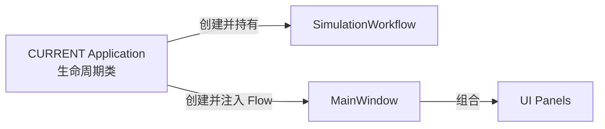

# NEXT 候选架构（Draft）

> 本文从 [ARCHITECTURE.md](../ARCHITECTURE.md) 拆出，是架构细节子文档。NEXT 是已确认产品边界但尚未批准实施的草案，全部对应 [requirements/](../requirements/) 中状态为 `Draft` 的 REQ-001 至 REQ-006。NEXT 必须先通过架构与 UI 设计评审并获用户批准，才能进入实现计划；本文为候选架构责任，不等于已批准实施。NEXT 是从 CURRENT 向长期 TARGET 演进的首个迁移切片，不是长期目标本身。

## 1. 需求到架构责任映射

`docs/requirements/` 统一管理需求 ID、验收结果与状态；本文档只映射由需求推导出的架构责任，不创建或重编号需求，不复制验收标准，不改变需求状态。

| 产品需求引用（requirements/，Draft） | 架构责任/约束（非验收标准） |
|----------|----------|
| REQ-001 统一模拟会话状态 | 一个业务对象统一拥有目标、任务、设备、选择和日志 |
| REQ-002 模拟设备指派 | 命令为已选目标对应的待执行模拟任务指派设备，并原子校验目标、任务和设备可用性 |
| REQ-003 模拟任务执行 | 状态机必须同时维护目标、任务和设备状态 |
| REQ-004 跨面板一致反馈 | UI 只能查询权威状态，不能维护独立业务副本 |
| REQ-005 可复现场景 | 场景提供器只构造初始数据，不成为运行时状态所有者 |
| REQ-006 完整操作记录 | 所有成功和拒绝命令进入同一进程内日志 |

## 2. NEXT 候选组件架构

下图只表达对象创建、注入和 UI 组合关系，不表达命令、状态或通知流。

NEXT 候选设计规则：

- CURRENT `Application` 生命周期类创建并持有 `SimulationWorkflow`，再注入 `MainWindow`。
- `DemoScenarioProvider` 只构造初始场景并交给 `SimulationWorkflow` 加载，不成为运行时状态所有者。
- `SimulationWorkflow` 统一拥有目标、任务、设备、当前选择和操作日志。
- 命令同步返回成功/失败及原因；非法命令不得产生部分状态修改。
- 状态变化发出统一 Qt 通知，MainWindow 回查权威状态后刷新 UI。
- Panel 只保存选中索引、折叠状态等 UI 状态，不保存可独立修改的业务状态。
- 不新增通用 Repository、Store、服务容器、事件总线或预留外部接口。

候选类名为现有实现事实，仅属于 NEXT 迁移切片；长期 TARGET 模块划分见 [ARCHITECTURE.md](../ARCHITECTURE.md) §5，NEXT 评审通过后是否向 TARGET 模块对齐由批准后的功能设计决定。
