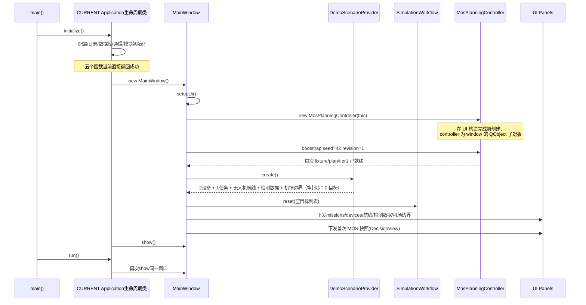

# CURRENT 启动与对象装配

> 本文从 [ARCHITECTURE.md](../ARCHITECTURE.md) 第 3 节迁出，是 CURRENT 实现细节子文档。描述当前启动时序、对象装配事实与页面栈路由。

装配事实：

- CURRENT `Application` 生命周期类创建 `MainWindow` 并负责显示。
- `MainWindow` 创建并按值拥有 `SimulationWorkflow`。
- `MosPlanningController` 在 `MainWindow` 构造早期、UI 创建前创建，作为 `MainWindow` 的 `QObject` 子对象；它内部按值持有 plain Core `MosPlanningSession` 与同步 `MosReplanWorker`，不引入生产 `QThread`。
- 启动期 controller 调用 `bootstrap(seed=42, revision=1)`，使用确定性 mulberry32 生成初始 fixture 与 tier1 规划，结果同步回 controller 与 `DecisionView` 快照；该 seed 只在 `MainWindow` 启动期使用，`MosGeneratorDialog` 中后续修改不持久化、不回写。
- `DemoScenarioProvider` 只提供初始模拟数据，不参与运行时状态。
- CURRENT `Application` 生命周期类的五个初始化函数（配置/日志/数据库/通信/模块）当前直接返回成功。
- 配置文件和外部依赖没有进入装配流程。

页面栈路由事实（`pageStack` 为 `QStackedWidget`，索引 0 = `SituationView`，索引 1 = `DecisionView`）：

- `NavigationWidget` 共 6 个导航项，索引 2 的 `key` 为 `decision`/`决策`。
- `onNavigationChanged(navIndex)` 路由：`navIndex == 2` -> `pageStack` 切到索引 1（`DecisionView`）并隐藏顶部工具栏；其他 nav 索引 -> `pageStack` 切到索引 0（`SituationView`）。
- `DecisionView` 不在 `pageStack` 之外的任何容器内重复实例化；它只持有 `MosPlanningSnapshot` 副本，不拥有会话状态、不发起规划、不联网。
