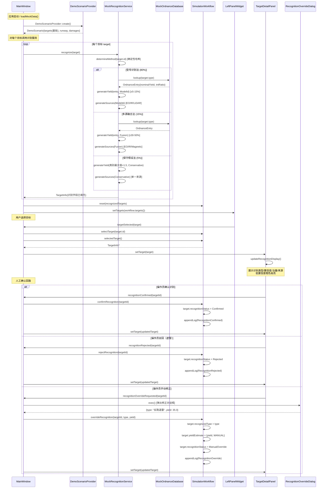
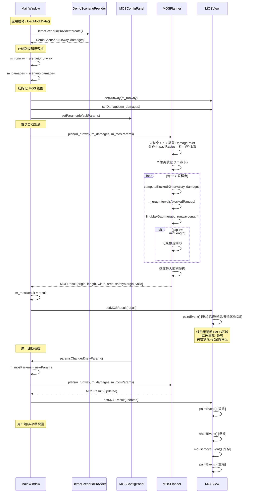
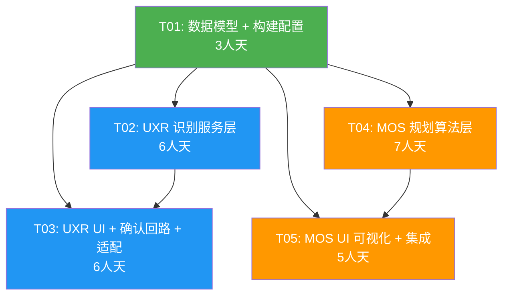

# 架构设计：未爆弹识别（UXR）+ 最小应急起降带规划（MOS）

| 字段 | 值 |
|------|-----|
| **文档编号** | SDD-INC-UXO-001 |
| **版本** | V1.0 |
| **日期** | 2026-07-08 |
| **撰写人** | 架构师 高见远（Gao） |
| **项目** | UXO_v1 排弹抢修指挥系统 |
| **阶段** | MVP（模拟/占位阶段） |
| **输入** | PRD-INC-UXO-001（产品经理 许清楚）、DDR-008、../archive/development/architecture-boundaries.md |
| **技术栈** | Qt 5 / CMake / C++17 桌面客户端 `UXOMissionControl` |

---

## 目录

- [Part A：系统设计](#part-a系统设计)
  - [1. 实现方案 + 框架选型](#1-实现方案--框架选型)
  - [2. 文件列表及相对路径](#2-文件列表及相对路径)
  - [3. 数据结构和接口（类图）](#3-数据结构和接口类图)
  - [4. 程序调用流程（时序图）](#4-程序调用流程时序图)
  - [5. 待明确事项](#5-待明确事项)
- [Part B：任务分解](#part-b任务分解)
  - [6. 依赖包列表](#6-依赖包列表)
  - [7. 任务列表（有序、含依赖关系）](#7-任务列表有序含依赖关系)
  - [8. 共享知识（跨文件约定）](#8-共享知识跨文件约定)
  - [9. 任务依赖图](#9-任务依赖图)
- [Part C：风险评估](#part-c风险评估)
  - [10. 关键风险点](#10-关键风险点)

---

# Part A：系统设计

## 1. 实现方案 + 框架选型

### 1.1 总体架构策略

两个功能遵循现有架构边界（`../archive/development/architecture-boundaries.md`）：

- **Core 层**：放稳定的数据模型、服务接口和纯逻辑算法，不依赖 UI 控件。
- **MainWindow 层**：只负责界面组合、用户交互和展示状态。
- **Simulation 层**：继续作为本地模拟数据入口，扩展注入识别结果和损毁场景。

MVP 模拟策略落地方式：
- 识别服务通过 `IRecognitionService` 抽象接口隔离，`MockRecognitionService` 实现该接口，由 `MainWindow` 构造函数注入。
- MOS 规划通过 `IMOSPlanner` 抽象接口隔离，`MOSPlanner` 实现该接口，同样由 `MainWindow` 持有。
- 所有模拟数据在 `DemoScenarioProvider::create()` 中生成，识别字段在场景创建后由 `MainWindow` 调用识别服务填充。
- 所有模拟类名含 `Mock` 前缀，UI 文案标注"模拟"，符合 `../archive/development/simulation-policy.md`。

### 1.2 功能一：未爆弹识别（UXR）实现思路

**核心挑战**：
1. 扩展 `TargetInfo` 不破坏现有代码——新字段全部有默认值，现有构造函数和信号槽不受影响。
2. 模拟 DDR-008 降级链——`MockRecognitionService` 内部模拟"型号识别→多源融合→保守假设"三层降级，概率可配置。
3. 人工确认回路——需要扩展 `SimulationWorkflow` 支持识别状态变更，复用现有日志机制。

**实现方案**：

| 子系统 | 方案 |
|--------|------|
| 数据模型 | 在 `Types.h` 中新增 `YieldConfidence`/`YieldEstimate`/`RecognitionStatus`/`SensorSource`/`SensorContribution`/`EstimationMethod`，扩展 `TargetInfo` |
| 识别服务 | `IRecognitionService` 纯虚接口 + `MockRecognitionService` 实现 + `MockOrdnanceDatabase` 模拟弹药数据库（5-8 种典型弹药） |
| 降级链模拟 | `MockRecognitionService` 基于 `target.id` 哈希做确定性"随机"，80% 走型号识别（HIGH），15% 走多源融合（MEDIUM），5% 走保守假设（CONSERVATIVE） |
| UI 展示 | 扩展 `TargetDetailPanel`，新增识别结果分区（类型/置信度/当量/来源），低置信度橙色高亮 |
| 人工确认 | `TargetDetailPanel` 新增"确认/驳回/修正"按钮，修正弹出 `RecognitionOverrideDialog`；操作经信号→`MainWindow`→`SimulationWorkflow` |
| 状态管理 | `SimulationWorkflow` 新增 `confirmRecognition()`/`rejectRecognition()`/`overrideRecognition()` 方法，复用现有日志机制 |

**接口注入方式**：`MainWindow` 持有 `std::unique_ptr<Core::IRecognitionService>`，在 `loadMockData()` 中对每个目标调用 `recognize()`。未来替换为真实 AI 实现时，只需修改 `MainWindow` 构造函数中的注入点。

### 1.3 功能二：最小应急起降带规划（MOS）实现思路

**核心挑战**：
1. 最大可用矩形算法——在含圆形障碍物的矩形区域内找最大轴对齐空矩形，需兼顾正确性和性能。
2. 安全距离计算——UXO 类损毁点的影响半径需从 `YieldEstimate` 按公式 D = K × W^(1/3) 计算。
3. 2D 可视化——QWidget 自绘跑道俯视图，支持缩放/平移，需处理坐标变换。

**实现方案**：

| 子系统 | 方案 |
|--------|------|
| 数据模型 | 新建 `include/Core/MOS/MOSDataModels.h`，定义 `RunwayModel`/`DamagePoint`/`MOSResult`/`MOSPlanParams`，全部为 POD 结构体 |
| 规划算法 | `IMOSPlanner` 纯虚接口 + `MOSPlanner` 实现。算法采用"Y 轴离散化 + X 轴扫描线"方法（见下方详述） |
| 安全距离 | 提供 `computeSafetyDistance(YieldEstimate, K)` 自由函数，W 取 `nominalYield + uncertainty`（保守上界） |
| 2D 可视化 | `MOSView` 继承 `QWidget`，重写 `paintEvent`，用 `QPainter` 绘制跑道/弹坑/安全区/MOS 矩形；支持鼠标滚轮缩放和拖拽平移 |
| 参数配置 | `MOSConfigPanel` 提供机型选择 + L_min/W_min/K/扩展系数输入，参数变更触发重规划 |
| 场景数据 | `DemoScenarioProvider` 扩展，输出模拟跑道和 5 个损毁点（3 弹坑 + 2 未爆弹）；亦支持从 `config/mos-demo-scenario.json` 加载 |

**MOS 规划算法详述（Y 轴离散化 + X 轴扫描线）**：

```
输入：RunwayModel [0,L]×[0,W]，DamagePoint 集合（含影响圆），MOSPlanParams
输出：MOSResult（最大可用矩形，或"无可用区域"）

1. 将宽度方向 [0,W] 离散化为 1m 步长（500 个采样点）
2. 对每个 Y 采样点 y0：
   a. 收集所有与 y=y0 水平线相交的影响圆，计算每个圆在该行的 X 遮挡区间 [xL, xR]
   b. 将遮挡区间按 xL 排序，合并重叠区间
   c. 在合并后的遮挡区间之间找最大 X 间隙 gap
   d. 若 gap >= minLength，记录候选矩形 (x_start, y0, gap, 合理宽度)
3. 在所有候选中选取面积最大者作为 MOS 结果
4. 若无满足约束的候选，返回 valid=false 并附原因
```

复杂度：O(W_steps × N × log N)，W_steps≈500，N=损毁点数（≤20），单次规划 <1ms，满足交互需求。

**注意**：上述算法对 Y 轴离散化采样，在 1m 步长下精度足够（MOS 宽度要求 ≥15m）。若需更高精度可减小步长。此为 MVP 占位算法，未来可替换为更精确的连续优化方法。

### 1.4 是否需要引入新依赖

| 依赖 | 是否需要 | 理由 |
|------|---------|------|
| Qt5::Widgets | 已有 | MOSView/MOSConfigPanel/RecognitionOverrideDialog 均基于 QWidget |
| Qt5::Core (QJsonDocument) | 已有 | JSON 配置加载使用 Qt5::Core 内置 JSON 支持 |
| Qt5::Gui (QPainter) | 已有 | MOS 2D 绘图使用 QPainter |
| QtCharts | **不需要** | P0 的置信度进度条用 QProgressBar 自绘即可，P1 的传感器贡献条形图也可用 QPainter |
| QtSvg | **不需要** | 2D 矢量绘图用 QPainter 直接绘制 |
| 第三方几何库 | **不需要** | 矩形-圆形相交判断为简单解析几何，自行实现 |

**结论：不需要新增任何 Qt 模块或第三方库。**

---

## 2. 文件列表及相对路径

### 2.1 Core/Data 模块（修改）

| 操作 | 相对路径 | 职责 |
|------|---------|------|
| **修改** | `include/Core/Data/Types.h` | 扩展 `TargetInfo`；新增 `YieldConfidence`/`YieldEstimate`/`EstimationMethod`/`RecognitionStatus`/`SensorSource`/`SensorContribution` |

### 2.2 Core/Recognition 模块（新增）

| 操作 | 相对路径 | 职责 |
|------|---------|------|
| **新增** | `include/Core/Recognition/IRecognitionService.h` | 识别服务抽象接口（纯虚类），预留真实 AI 接入边界 |
| **新增** | `include/Core/Recognition/MockOrdnanceDatabase.h` | 模拟弹药数据库头文件（5-8 种典型弹药的型号/装药量/TNT 当量系数） |
| **新增** | `src/Core/Recognition/MockOrdnanceDatabase.cpp` | 模拟弹药数据库实现 |
| **新增** | `include/Core/Recognition/MockRecognitionService.h` | 模拟识别服务头文件，继承 `IRecognitionService` |
| **新增** | `src/Core/Recognition/MockRecognitionService.cpp` | 模拟识别服务实现（降级链逻辑 + 确定性随机） |

### 2.3 Core/MOS 模块（新增）

| 操作 | 相对路径 | 职责 |
|------|---------|------|
| **新增** | `include/Core/MOS/MOSDataModels.h` | MOS 数据结构定义（`RunwayModel`/`DamagePoint`/`MOSResult`/`MOSPlanParams`）+ 安全距离计算函数 |
| **新增** | `include/Core/MOS/IMOSPlanner.h` | MOS 规划抽象接口（纯虚类） |
| **新增** | `include/Core/MOS/MOSPlanner.h` | MOS 规划实现头文件，继承 `IMOSPlanner` |
| **新增** | `src/Core/MOS/MOSPlanner.cpp` | MOS 规划算法实现（Y 轴离散化 + X 轴扫描线） |

### 2.4 Core/Simulation 模块（修改）

| 操作 | 相对路径 | 职责 |
|------|---------|------|
| **修改** | `include/Core/Simulation/DemoScenarioProvider.h` | `DemoScenario` 结构新增 `runway` 和 `damages` 字段 |
| **修改** | `src/Core/Simulation/DemoScenarioProvider.cpp` | 生成模拟损毁点（3 弹坑 + 2 未爆弹）和跑道模型 |
| **修改** | `include/Core/Simulation/SimulationWorkflow.h` | 新增识别状态操作方法和识别操作日志类型 |
| **修改** | `src/Core/Simulation/SimulationWorkflow.cpp` | 实现识别状态变更逻辑（确认/驳回/修正） |

### 2.5 MainWindow 模块（修改 + 新增）

| 操作 | 相对路径 | 职责 |
|------|---------|------|
| **修改** | `include/MainWindow/TargetDetailPanel.h` | 新增识别结果展示分区和确认/驳回/修正按钮声明 |
| **修改** | `src/MainWindow/TargetDetailPanel.cpp` | 实现识别结果展示 UI 和操作按钮逻辑 |
| **新增** | `include/MainWindow/RecognitionOverrideDialog.h` | 手动修正对话框头文件 |
| **新增** | `src/MainWindow/RecognitionOverrideDialog.cpp` | 手动修正对话框实现（类型选择 + 当量输入） |
| **新增** | `include/MainWindow/MOSView.h` | MOS 2D 可视化视图头文件 |
| **新增** | `src/MainWindow/MOSView.cpp` | MOS 2D 可视化实现（QPainter 自绘 + 缩放/平移） |
| **新增** | `include/MainWindow/MOSConfigPanel.h` | MOS 参数配置面板头文件 |
| **新增** | `src/MainWindow/MOSConfigPanel.cpp` | MOS 参数配置面板实现 |
| **修改** | `include/MainWindow/MainWindow.h` | 新增识别服务和 MOS 规划器成员；新增 MOS 相关槽函数 |
| **修改** | `src/MainWindow/MainWindow.cpp` | 集成识别服务注入、MOS 面板创建和信号连接 |

### 2.6 构建配置（修改）

| 操作 | 相对路径 | 职责 |
|------|---------|------|
| **修改** | `src/Core/CMakeLists.txt` | 新增 Recognition 和 MOS 源文件 |
| **修改** | `src/MainWindow/CMakeLists.txt` | 新增 MOSView/MOSConfigPanel/RecognitionOverrideDialog 源文件 |

### 2.7 配置数据（新增）

| 操作 | 相对路径 | 职责 |
|------|---------|------|
| **新增** | `config/mos-demo-scenario.json` | 模拟损毁场景配置（跑道参数 + 损毁点列表），标注"模拟数据" |

### 2.8 文件汇总

| 类别 | 新增 | 修改 | 合计 |
|------|:----:|:----:|:----:|
| Core/Data | 0 | 1 | 1 |
| Core/Recognition | 5 | 0 | 5 |
| Core/MOS | 4 | 0 | 4 |
| Core/Simulation | 0 | 4 | 4 |
| MainWindow | 6 | 4 | 10 |
| 构建配置 | 0 | 2 | 2 |
| 配置数据 | 1 | 0 | 1 |
| **合计** | **16** | **11** | **27** |

---

## 3. 数据结构和接口（类图）

```mermaid
classDiagram
    %% ===== Core/Data 层 =====
    class YieldConfidence {
        <<enumeration>>
        Unknown
        High
        Medium
        Low
        Conservative
    }

    class EstimationMethod {
        <<enumeration>>
        Unknown
        ModelId
        Dimension
        Fusion
        Manual
        Conservative
    }

    class RecognitionStatus {
        <<enumeration>>
        Unknown
        AutoDetected
        Confirmed
        Rejected
        ManualOverride
    }

    class SensorSource {
        <<enumeration>>
        Unknown
        EO
        IR
        LiDAR
        GPR
        Magnetic
    }

    class YieldEstimate {
        +double nominalYield
        +double uncertainty
        +YieldConfidence confidence
        +EstimationMethod estimationMethod
        +YieldEstimate()
    }

    class SensorContribution {
        +SensorSource source
        +double contribution
        +SensorContribution()
    }

    class TargetInfo {
        +QString id
        +TargetType type
        +QString typeName
        +QVector3D position
        +double depth
        +double confidence
        +ThreatLevel threatLevel
        +TargetStatus status
        +QDateTime detectTime
        +QDateTime updateTime
        %% === 识别扩展字段 ===
        +QString recognizedType
        +double recognitionConfidence
        +YieldEstimate yieldEstimate
        +QVector~SensorContribution~ recognitionSources
        +RecognitionStatus recognitionStatus
        +QDateTime recognitionTime
        +TargetInfo()
    }

    %% ===== Core/MOS 数据模型 =====
    class RunwayModel {
        +double length
        +double width
        +double heading
        +RunwayModel()
    }

    class DamagePoint {
        +QString id
        +QVector2D position
        +Type type
        +double impactRadius
        +QString source
        +DamagePoint()
    }

    class MOSResult {
        +QVector2D origin
        +double length
        +double width
        +double area
        +double safetyMargin
        +bool valid
        +QString reason
        +MOSResult()
    }

    class MOSPlanParams {
        +double minLength
        +double minWidth
        +double safetyFactorK
        +double craterExpandFactor
        +MOSPlanParams()
    }

    %% ===== Core/Recognition 服务层 =====
    class IRecognitionService {
        <<interface>>
        +~IRecognitionService()
        +recognize(input: TargetInfo) TargetInfo*
    }

    class MockOrdnanceDatabase {
        -QVector~OrdnanceEntry~ m_entries
        +MockOrdnanceDatabase()
        +lookup(type: TargetType) OrdnanceEntry*
        +size() int
    }

    class MockRecognitionService {
        -MockOrdnanceDatabase m_database
        -double m_modelIdProbability
        -double m_fusionProbability
        +MockRecognitionService()
        +recognize(input: TargetInfo) TargetInfo*
        -determineMethod(targetId: QString) EstimationMethod
        -generateYield(entry: OrdnanceEntry, method: EstimationMethod) YieldEstimate
        -generateSources(method: EstimationMethod) QVector~SensorContribution~
    }

    %% ===== Core/MOS 规划层 =====
    class IMOSPlanner {
        <<interface>>
        +~IMOSPlanner()
        +plan(runway: RunwayModel, damages: QVector~DamagePoint~, params: MOSPlanParams) MOSResult*
    }

    class MOSPlanner {
        +MOSPlanner()
        +plan(runway: RunwayModel, damages: QVector~DamagePoint~, params: MOSPlanParams) MOSResult*
        -computeBlockedXIntervals(y: double, damages: QVector~DamagePoint~) QVector~QPair~
        -mergeIntervals(intervals: QVector~QPair~) QVector~QPair~
        -findMaxGap(intervals: QVector~QPair~, runwayLength: double) double
    }

    %% ===== Simulation 层 =====
    class SimulationWorkflow {
        -QVector~TargetInfo~ m_targets
        -QString m_selectedTargetId
        -QVector~SimulationOperationLogEntry~ m_logEntries
        +reset(targets: QVector~TargetInfo~)
        +selectTarget(targetId: QString) bool
        +requestSelectedTargetStatus(status: TargetStatus) bool
        +confirmRecognition(targetId: QString) bool
        +rejectRecognition(targetId: QString) bool
        +overrideRecognition(targetId: QString, type: QString, yield: double) bool
        +targets() QVector~TargetInfo~&
        +selectedTarget() TargetInfo*
        +logEntries() QVector~SimulationOperationLogEntry~&
    }

    class DemoScenarioProvider {
        +create() DemoScenario*
    }

    class DemoScenario {
        +QString label
        +QVector~TargetInfo~ targets
        +QVector~MissionInfo~ missions
        +QVector~DeviceInfo~ devices
        +RunwayModel runway
        +QVector~DamagePoint~ damages
    }

    %% ===== MainWindow UI 层 =====
    class TargetDetailPanel {
        -QLabel* m_recognizedTypeLabel
        -QProgressBar* m_confidenceBar
        -QLabel* m_yieldLabel
        -QLabel* m_confidenceLevelLabel
        -QLabel* m_sourcesLabel
        -QPushButton* m_confirmRecogBtn
        -QPushButton* m_rejectRecogBtn
        -QPushButton* m_overrideRecogBtn
        +setTarget(target: TargetInfo)
        -setupRecognitionSection() QWidget*
        -updateRecognitionDisplay()
    }

    class RecognitionOverrideDialog {
        +RecognitionOverrideDialog(parent: QWidget*)
        +getSelectedType() QString
        +getNominalYield() double
    }

    class MOSView {
        -RunwayModel m_runway
        -QVector~DamagePoint~ m_damages
        -MOSResult m_result
        -double m_scale
        -QPointF m_offset
        +setRunway(runway: RunwayModel)
        +setDamages(damages: QVector~DamagePoint~)
        +setMOSResult(result: MOSResult)
        +resetView()
        -paintEvent(event: QPaintEvent*)
        -wheelEvent(event: QWheelEvent*)
        -mousePressEvent(event: QMouseEvent*)
        -mouseMoveEvent(event: QMouseEvent*)
    }

    class MOSConfigPanel {
        -QComboBox* m_aircraftCombo
        -QDoubleSpinBox* m_minLengthSpin
        -QDoubleSpinBox* m_minWidthSpin
        -QDoubleSpinBox* m_safetyKSpin
        -QDoubleSpinBox* m_craterExpandSpin
        +setParams(params: MOSPlanParams)
        +getParams() MOSPlanParams
        +paramsChanged(params: MOSPlanParams)*
    }

    class MainWindow {
        -SimulationWorkflow m_simulationWorkflow
        -unique_ptr~IRecognitionService~ m_recognitionService
        -unique_ptr~IMOSPlanner~ m_mosPlanner
        -RunwayModel m_runway
        -QVector~DamagePoint~ m_damages
        -MOSPlanParams m_mosParams
        -MOSResult m_mosResult
        -MOSView* m_mosView
        -MOSConfigPanel* m_mosConfigPanel
        +loadMockData()
        +onRecognitionConfirmed(targetId: QString)
        +onRecognitionRejected(targetId: QString)
        +onRecognitionOverrideRequested(targetId: QString)
        +onMOSParamsChanged(params: MOSPlanParams)
        +onMOSReplanRequested()
    }

    %% ===== 关系 =====
    YieldEstimate --> YieldConfidence
    YieldEstimate --> EstimationMethod
    SensorContribution --> SensorSource
    TargetInfo --> YieldEstimate : contains
    TargetInfo --> SensorContribution : contains *
    TargetInfo --> RecognitionStatus

    MockRecognitionService ..|> IRecognitionService : implements
    MockRecognitionService --> MockOrdnanceDatabase : owns
    MockRecognitionService ..> TargetInfo : produces

    MOSPlanner ..|> IMOSPlanner : implements
    MOSPlanner ..> RunwayModel : uses
    MOSPlanner ..> DamagePoint : uses
    MOSPlanner ..> MOSResult : produces
    MOSPlanner ..> MOSPlanParams : uses

    DemoScenario --> RunwayModel : contains
    DemoScenario --> DamagePoint : contains *
    DemoScenario --> TargetInfo : contains *
    DemoScenarioProvider ..> DemoScenario : creates

    SimulationWorkflow --> TargetInfo : manages *

    MainWindow --> SimulationWorkflow : owns
    MainWindow --> IRecognitionService : owns
    MainWindow --> IMOSPlanner : owns
    MainWindow --> MOSView : owns
    MainWindow --> MOSConfigPanel : owns
    MainWindow --> TargetDetailPanel : references

    TargetDetailPanel ..> TargetInfo : displays
    TargetDetailPanel ..> RecognitionOverrideDialog : creates
    MOSView ..> RunwayModel : displays
    MOSView ..> DamagePoint : displays
    MOSView ..> MOSResult : displays
    MOSConfigPanel ..> MOSPlanParams : edits
```



---

## 4. 程序调用流程（时序图）

### 4.1 识别流程：场景生成 → 识别 → 展示 → 人工确认



### 4.2 MOS 规划流程：损毁输入 → 安全距离 → 规划 → 可视化



---

## 5. 待明确事项

### 5.1 需业务方确认（继承自 PRD 第 7 节）

| 编号 | 问题 | 架构影响 | 当前假设 |
|:---:|------|---------|---------|
| MOS-Q1 | 目标机型最小起降尺寸 | `MOSPlanParams` 默认值 | 460m×15m（歼击机最小） |
| MOS-Q3 | 安全系数 K 取值 | `MOSPlanParams.safetyFactorK` 默认值 | K=1.5 |
| MOS-Q4 | 弹坑结构损伤扩展系数 | `MOSPlanParams.craterExpandFactor` 默认值 | 1.5 |
| MOS-Q6 | 跑道坐标系定义 | `RunwayModel` 坐标系约定 | 本地跑道坐标系（米制） |
| UXR-Q1 | 模拟弹药数据库覆盖型号 | `MockOrdnanceDatabase` 数据内容 | 用 SRS 6 种 TargetType 构造 |
| UXR-Q4 | 未来真实 AI 调用方式 | `IRecognitionService` 方法签名 | 同步调用 + TargetInfo 输入输出 |
| UXR-Q5 | 当量数据保密分级 | `TargetInfo` 是否需要 securityLevel 字段 | MVP 预留字段位置，不实现分级 |

### 5.2 需架构评审确认

| 编号 | 决策点 | 当前方案 | 备选方案 |
|:---:|--------|---------|---------|
| A1 | `estimationMethod` 用枚举还是 QString | **枚举** `EstimationMethod`（类型安全） | PRD 建议 QString（灵活但易错） |
| A2 | `recognitionSources` 用 `QVector<SensorContribution>` 还是 `QVector<SensorSource>` | **`QVector<SensorContribution>`**（P0 UI 已需展示贡献百分比） | PRD 建议 `QVector<SensorSource>`（P1 需破坏性变更） |
| A3 | 识别服务注入位置 | **MainWindow 构造函数注入**（简单直接） | 服务定位器模式（过度设计） |
| A4 | MOS 状态归属 | **MainWindow 成员变量**（MVP 简单） | 独立 MOSWorkflow 类（P1 再拆） |
| A5 | MOSView 集成方式 | **NavigationWidget 新增"MOS规划"页**，切换中心区域 | 独立窗口 / DockWidget |

---

# Part B：任务分解

## 6. 依赖包列表

| 包/模块 | 版本 | 用途 | 是否新增 |
|---------|------|------|:--------:|
| Qt5::Core | ≥5.15 | JSON 解析、数据类型、信号槽 | 否（已有） |
| Qt5::Widgets | ≥5.15 | QWidget/QPainter/QDialog 等 UI 控件 | 否（已有） |
| Qt5::Gui | ≥5.15 | QPainter 2D 绘图 | 否（已有） |

**结论：无需新增任何依赖包。** 所有功能基于现有 Qt5 模块实现。

---

## 7. 任务列表（有序、含依赖关系）

### T01：数据模型 + 构建配置（基础设施）

| 字段 | 值 |
|------|-----|
| **任务名** | 数据模型扩展 + MOS 数据结构 + CMake 配置 |
| **源文件** | `include/Core/Data/Types.h`（修改）<br>`include/Core/MOS/MOSDataModels.h`（新增）<br>`src/Core/CMakeLists.txt`（修改）<br>`src/MainWindow/CMakeLists.txt`（修改） |
| **依赖** | 无 |
| **优先级** | P0 |
| **预估** | 3 人天 |
| **对应需求** | UXR-001（数据结构部分）、MOS-001（数据结构部分） |

**工作内容**：
1. 在 `Types.h` 中新增 `YieldConfidence`、`EstimationMethod`、`RecognitionStatus`、`SensorSource` 枚举和 `YieldEstimate`、`SensorContribution` 结构体
2. 扩展 `TargetInfo`：新增 `recognizedType`、`recognitionConfidence`、`yieldEstimate`、`recognitionSources`、`recognitionStatus`、`recognitionTime` 字段（全部有默认值，不破坏现有代码）
3. 新建 `MOSDataModels.h`：定义 `RunwayModel`、`DamagePoint`、`MOSResult`、`MOSPlanParams` 结构体 + `computeSafetyDistance()` 自由函数
4. 更新 `src/Core/CMakeLists.txt`：预留 Recognition 和 MOS 源文件条目
5. 更新 `src/MainWindow/CMakeLists.txt`：预留新 UI 源文件条目
6. 所有新结构体注释标注"模拟数据结构，预留真实接口"

---

### T02：UXR 识别服务层

| 字段 | 值 |
|------|-----|
| **任务名** | IRecognitionService 接口 + MockRecognitionService + 模拟弹药数据库 |
| **源文件** | `include/Core/Recognition/IRecognitionService.h`（新增）<br>`include/Core/Recognition/MockOrdnanceDatabase.h`（新增）<br>`src/Core/Recognition/MockOrdnanceDatabase.cpp`（新增）<br>`include/Core/Recognition/MockRecognitionService.h`（新增）<br>`src/Core/Recognition/MockRecognitionService.cpp`（新增） |
| **依赖** | T01 |
| **优先级** | P0 |
| **预估** | 6 人天 |
| **对应需求** | UXR-002（模拟识别服务）、UXR-005（接口抽象） |

**工作内容**：
1. 定义 `IRecognitionService` 纯虚接口，声明 `recognize(const TargetInfo&)` 方法，注释标注"未来真实 AI 实现此接口"
2. 实现 `MockOrdnanceDatabase`：内置 6 种典型弹药数据（型号/标称装药量/TNT 当量系数/壁厚/尺寸），注释标注"模拟数据"
3. 实现 `MockRecognitionService`：
   - 基于 `target.id` 哈希做确定性"随机"（同一目标多次调用结果一致）
   - 降级链：80% ModelId（HIGH，±5-15%）、15% Fusion（MEDIUM，±30-50%）、5% Conservative（CONSERVATIVE，类别最大值×1.5）
   - 概率分布可通过构造函数参数配置
4. 所有类名含 `Mock` 前缀，注释标注"模拟服务，不连接真实 AI"

---

### T03：UXR UI 展示 + 人工确认回路 + 模拟数据适配

| 字段 | 值 |
|------|-----|
| **任务名** | TargetDetailPanel 识别展示 + 确认回路 + SimulationWorkflow 扩展 + DemoScenarioProvider 适配 |
| **源文件** | `include/Core/Simulation/DemoScenarioProvider.h`（修改）<br>`src/Core/Simulation/DemoScenarioProvider.cpp`（修改）<br>`include/Core/Simulation/SimulationWorkflow.h`（修改）<br>`src/Core/Simulation/SimulationWorkflow.cpp`（修改）<br>`include/MainWindow/TargetDetailPanel.h`（修改）<br>`src/MainWindow/TargetDetailPanel.cpp`（修改）<br>`include/MainWindow/RecognitionOverrideDialog.h`（新增）<br>`src/MainWindow/RecognitionOverrideDialog.cpp`（新增） |
| **依赖** | T01、T02 |
| **优先级** | P0 |
| **预估** | 6 人天 |
| **对应需求** | UXR-003（UI 展示）、UXR-004（人工确认回路） |

**工作内容**：
1. 扩展 `DemoScenario`：新增 `runway` 和 `damages` 字段；`DemoScenarioProvider::create()` 生成 3 个模拟目标 + 模拟损毁点数据
2. 扩展 `SimulationWorkflow`：新增 `confirmRecognition()`/`rejectRecognition()`/`overrideRecognition()` 方法，复用现有日志机制记录识别操作
3. 扩展 `TargetDetailPanel`：
   - 新增"模拟识别结果"分区：识别类型、置信度进度条（绿/黄/橙/红）、当量估算（"45.0 ± 6.8 kg TNT"格式）、置信度等级、识别方法、数据来源列表
   - 新增"确认/驳回/修正"三个按钮，发射信号到 MainWindow
   - 低置信度（CONSERVATIVE/LOW）橙色高亮
4. 实现 `RecognitionOverrideDialog`：类型选择（QComboBox）+ 当量输入（QDoubleSpinBox），返回修正值
5. `MainWindow::loadMockData()` 适配：创建 `MockRecognitionService`，对每个目标调用 `recognize()`，将识别结果注入 `SimulationWorkflow`

---

### T04：MOS 规划算法层

| 字段 | 值 |
|------|-----|
| **任务名** | IMOSPlanner 接口 + MOSPlanner 算法实现 + 模拟损毁场景配置 |
| **源文件** | `include/Core/MOS/IMOSPlanner.h`（新增）<br>`include/Core/MOS/MOSPlanner.h`（新增）<br>`src/Core/MOS/MOSPlanner.cpp`（新增）<br>`config/mos-demo-scenario.json`（新增） |
| **依赖** | T01 |
| **优先级** | P0 |
| **预估** | 7 人天 |
| **对应需求** | MOS-001（跑道与损毁模型）、MOS-002（MOS 自动规划算法） |

**工作内容**：
1. 定义 `IMOSPlanner` 纯虚接口，声明 `plan()` 方法
2. 实现 `MOSPlanner`：
   - Y 轴离散化（1m 步长）+ X 轴扫描线算法
   - `computeBlockedXIntervals()`：计算每个 Y 采样点的 X 遮挡区间
   - `mergeIntervals()`：合并重叠遮挡区间
   - `findMaxGap()`：在遮挡区间之间找最大 X 间隙
   - 安全距离计算：UXO 类损毁点 impactRadius = K × (nominalYield + uncertainty)^(1/3)
   - 无法找到满足约束的 MOS 时返回 `valid=false` 并附原因
3. 创建 `config/mos-demo-scenario.json`：模拟跑道 3000×500m + 5 个损毁点（3 弹坑 + 2 未爆弹），标注"模拟数据"
4. 算法为纯本地计算，无外部依赖

---

### T05：MOS UI 可视化 + MainWindow 集成

| 字段 | 值 |
|------|-----|
| **任务名** | MOSView 2D 画布 + MOSConfigPanel 参数面板 + MainWindow 集成 |
| **源文件** | `include/MainWindow/MOSView.h`（新增）<br>`src/MainWindow/MOSView.cpp`（新增）<br>`include/MainWindow/MOSConfigPanel.h`（新增）<br>`src/MainWindow/MOSConfigPanel.cpp`（新增）<br>`include/MainWindow/MainWindow.h`（修改）<br>`src/MainWindow/MainWindow.cpp`（修改） |
| **依赖** | T01、T04 |
| **优先级** | P0 |
| **预估** | 5 人天 |
| **对应需求** | MOS-003（2D 可视化）、MOS-004（参数配置） |

**工作内容**：
1. 实现 `MOSView`（QWidget 自绘）：
   - `paintEvent()`：绘制跑道轮廓（灰）、弹坑区域（红色填充）、未爆弹安全距离区域（黄色填充）、MOS 候选区域（绿色半透明矩形+边界标注）
   - 鼠标滚轮缩放、拖拽平移
   - MOS 矩形上标注起止坐标和尺寸
   - 图例标注"模拟规划结果"
2. 实现 `MOSConfigPanel`：
   - 机型选择（QComboBox）、L_min/W_min/K/扩展系数输入（QDoubleSpinBox）
   - 参数变更发射 `paramsChanged` 信号
   - 默认值标注"示例值，待业务确认"
3. 集成到 `MainWindow`：
   - 新增 `m_mosView`、`m_mosConfigPanel`、`m_mosPlanner` 成员
   - NavigationWidget 新增"MOS规划"导航项，切换中心区域显示 MOSView
   - `loadMockData()` 中加载跑道和损毁点数据，执行首次规划
   - 连接 MOSConfigPanel 参数变更信号 → 重规划 → 更新 MOSView

---

### 任务总览

| 任务 | 名称 | 文件数 | 预估(人天) | 依赖 | 对应需求 |
|:----:|------|:------:|:---------:|:----:|---------|
| T01 | 数据模型 + 构建配置 | 4 | 3 | — | UXR-001, MOS-001 |
| T02 | UXR 识别服务层 | 5 | 6 | T01 | UXR-002, UXR-005 |
| T03 | UXR UI + 确认回路 + 适配 | 8 | 6 | T01, T02 | UXR-003, UXR-004 |
| T04 | MOS 规划算法层 | 4 | 7 | T01 | MOS-001, MOS-002 |
| T05 | MOS UI 可视化 + 集成 | 6 | 5 | T01, T04 | MOS-003, MOS-004 |
| **合计** | | **27** | **27** | | **P0 全覆盖** |

> PM 估算 P0 合计 27 人天（UXR 15 + MOS 12），本架构分解合计 27 人天，一致。

---

## 8. 共享知识（跨文件约定）

### 8.1 命名规范

| 规则 | 示例 |
|------|------|
| 模拟服务类名含 `Mock` 前缀 | `MockRecognitionService`、`MockOrdnanceDatabase` |
| 抽象接口类名含 `I` 前缀 | `IRecognitionService`、`IMOSPlanner` |
| 模拟数据文件含 `demo`/`mock` 标识 | `mos-demo-scenario.json` |
| 枚举值用 PascalCase | `YieldConfidence::High`、`RecognitionStatus::AutoDetected` |
| 结构体成员用 camelCase | `nominalYield`、`impactRadius` |

### 8.2 注释规范

- 所有代码注释使用**中文**（遵循 AGENTS.md）。
- 模拟/占位类必须在类注释首行标注：`// 模拟服务，不连接真实 AI/设备` 或 `// 接口占位，尚未接入真实实现`。
- 数据结构注释标注：`// 模拟数据结构，预留真实接口`。
- UI 文案必须包含"模拟"字样：`"模拟识别结果"`、`"模拟规划结果"`、`"模拟数据"`。

### 8.3 坐标系约定

| 场景 | 坐标系 | 原点 | 单位 |
|------|--------|------|------|
| MOS 跑道模型 | 本地跑道坐标系 | 跑道一端中心点 | 米 (m) |
| MOS X 轴 | 沿跑道长度方向 | — | 米 |
| MOS Y 轴 | 沿跑道宽度方向 | — | 米 |
| TargetInfo.position | 现有经纬度坐标 | WGS84 | 度 |
| 损毁点→TargetInfo 关联 | DamagePoint.source 标注来源 TargetInfo.id | — | — |

**安全距离计算约定**：
- 公式：D = K × W^(1/3)
- W 取保守上界：W = `yieldEstimate.nominalYield + yieldEstimate.uncertainty`
- K 来自 `MOSPlanParams.safetyFactorK`
- 弹坑影响半径 = 可见半径 × `MOSPlanParams.craterExpandFactor`

### 8.4 接口注入方式

- **构造函数注入**：`MainWindow` 在构造函数中创建 `MockRecognitionService` 和 `MOSPlanner`，通过 `std::unique_ptr` 持有。
- **未来替换路径**：真实 AI 识别服务只需实现 `IRecognitionService`，在 `MainWindow` 构造函数中替换 `MockRecognitionService` 即可，无需修改其他代码。
- **不使用服务定位器**：MVP 阶段注入点单一，服务定位器模式属于过度设计。

### 8.5 模拟数据确定性约定

- `MockRecognitionService::recognize()` 必须是**确定性**的：同一 `TargetInfo` 输入始终产生同一输出。
- 确定性实现方式：以 `target.id` 的哈希值为种子，决定降级链分支和当量扰动范围。
- 降级链概率分布（80%/15%/5%）可通过构造函数参数配置，但默认值固定。

### 8.6 日志约定

- 识别操作日志复用 `SimulationWorkflow` 现有日志机制（`SimulationOperationLogEntry`）。
- 新增日志类型：`RecognitionConfirmed`、`RecognitionRejected`、`RecognitionOverride`。
- 日志消息前缀 `[模拟]`，与现有日志保持一致。

---

## 9. 任务依赖图



**关键路径**：T01 → T02 → T03（UXR 线，15 人天）和 T01 → T04 → T05（MOS 线，15 人天）。

**并行机会**：T02 和 T04 可并行开发（都只依赖 T01）；T03 和 T05 可并行开发（分别依赖 T02/T04）。

**建议开发顺序**（遵循 PM 建议先 UXR 后 MOS）：
1. 第 1 周：T01（3d）
2. 第 2-3 周：T02（6d）→ T03（6d）= UXR P0 完成
3. 第 4-5 周：T04（7d）
4. 第 6 周：T05（5d）= MOS P0 完成

---

# Part C：风险评估

## 10. 关键风险点

### 10.1 技术风险

| 编号 | 风险 | 概率 | 影响 | 缓解措施 |
|:---:|------|:---:|:---:|---------|
| R1 | **MOS 算法边界情况**：Y 轴离散化可能在损毁圆切线处遗漏极窄可用区域，导致漏报可用 MOS | 中 | 中 | 1) 步长取 1m（远小于 MOS 最小宽度 15m）；2) 算法返回"无可用区域"时附原因供人工判断；3) P1 可增加连续优化精化 |
| R2 | **Qt 2D 绘图性能**：MOSView 在高频参数调整时可能触发频繁重绘 | 低 | 低 | 1) 参数变更后单次 `update()` 触发重绘，非定时刷新；2) 跑道尺寸固定（3000×500m），绘图为静态矢量，性能无瓶颈；3) 缩放/平移使用双缓冲 |
| R3 | **TargetInfo 扩展兼容性**：新增字段可能影响现有序列化或测试 | 低 | 中 | 1) 新字段全部有默认值，现有构造函数不变；2) 当前代码无 TargetInfo 序列化逻辑（纯内存对象）；3) 现有测试（startup_visible_test、demo_scenario_test）不涉及新字段 |
| R4 | **确定性随机实现偏差**：`MockRecognitionService` 的哈希降级链分布可能偏离 80/15/5 目标 | 低 | 低 | 1) 使用 `qHash(target.id)` 作为种子，分布均匀；2) 降级链概率可配置，演示时可调整；3) MVP 阶段精度要求不高，关键是确定性 |

### 10.2 业务风险

| 编号 | 风险 | 概率 | 影响 | 缓解措施 |
|:---:|------|:---:|:---:|---------|
| R5 | **MOS 业务定义未确认**：MOS-Q1~Q8 共 8 个待确认问题，默认值可能随业务澄清而变更 | **高** | **高** | 1) 所有业务参数集中在 `MOSPlanParams` 结构体，默认值标注"示例值，待业务确认"；2) 参数通过 UI 和 JSON 双通道可配置，变更不需改代码；3) 算法与参数解耦，参数变更只需重规划 |
| R6 | **当量数据保密性**：UXR-Q5 涉及军事情报分级，MVP 模拟数据虽不涉密但需预留分级字段 | 低 | 中 | 1) MVP 不实现分级存储，`TargetInfo` 预留 `securityLevel` 字段位置（注释标注"预留"）；2) 模拟弹药数据库数据为虚构，不涉及真实装备参数；3) UI 标注"模拟数据" |
| R7 | **模拟弹药数据库真实性不足**：UXR-Q1 待业务方提供真实型号参数，当前用 SRS 6 种 TargetType 构造 | 中 | 低 | 1) 数据库设计为可配置（JSON 或代码内表），替换数据不需改架构；2) MVP 演示重点是流程闭环而非数据真实性；3) 数据注释标注"虚构模拟数据" |

### 10.3 架构风险

| 编号 | 风险 | 概率 | 影响 | 缓解措施 |
|:---:|------|:---:|:---:|---------|
| R8 | **MainWindow 集成侵入性**：T03 和 T05 都需修改 MainWindow，增加其复杂度 | 中 | 中 | 1) 遵循现有信号槽模式，新功能通过新信号/新面板隔离；2) 识别操作复用 SimulationWorkflow 现有模式；3) MOS 面板通过 NavigationWidget 切换，不侵入现有中心区域布局 |
| R9 | **模拟服务替换边界模糊**：`IRecognitionService` 接口签名可能与未来真实 AI 调用方式不匹配 | 中 | 中 | 1) 接口按同步调用 + `TargetInfo` 输入输出设计（UXR-Q4 假设）；2) 注释明确标注"MVP 同步设计，未来可能需适配异步/图像输入"；3) 接口只声明一个 `recognize()` 方法，最小化耦合 |
| R10 | **MOS 状态管理分散**：MOS 相关状态（runway/damages/params/result）散落在 MainWindow 成员中 | 低 | 低 | 1) MVP 阶段状态简单，MainWindow 成员可管理；2) P1 若需复杂状态流转（如动态重规划 MOS-009），再抽取 `MOSWorkflow` 类；3) 当前设计遵循"不为大而空的模块创建目录树"原则 |

### 10.4 风险矩阵

```
影响 ↑
高   │  R5●
     │
中   │  R1●  R3●  R8●  R9●  R6●
     │
低   │  R2●  R4●  R7●  R10●
     └────────────────────────→ 概率
        低      中      高
```

**最高优先级风险**：R5（MOS 业务定义未确认）——概率高、影响高，但缓解措施已内置于参数可配置设计。建议在 T04 开发前推动业务方确认 MOS-Q1/Q3/Q4 至少三个核心参数。

---

**文档结束**

> 本架构设计基于 PRD-INC-UXO-001、DDR-008 和现有代码结构，覆盖 UXR 和 MOS 两个功能的 P0 需求。所有模拟/占位实现均明确标注，接口边界清晰，为未来真实接入预留替换路径。任务分解为 5 个有序任务，总计 27 人天，与 PM 估算一致。
