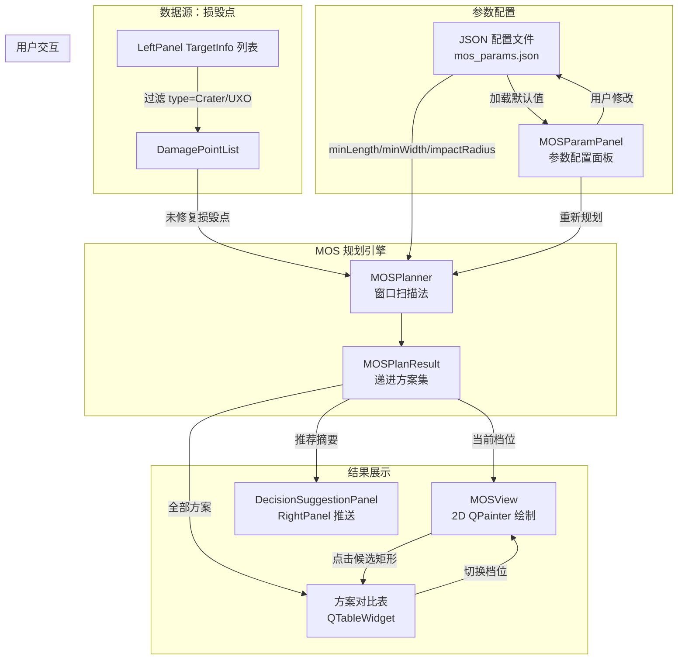
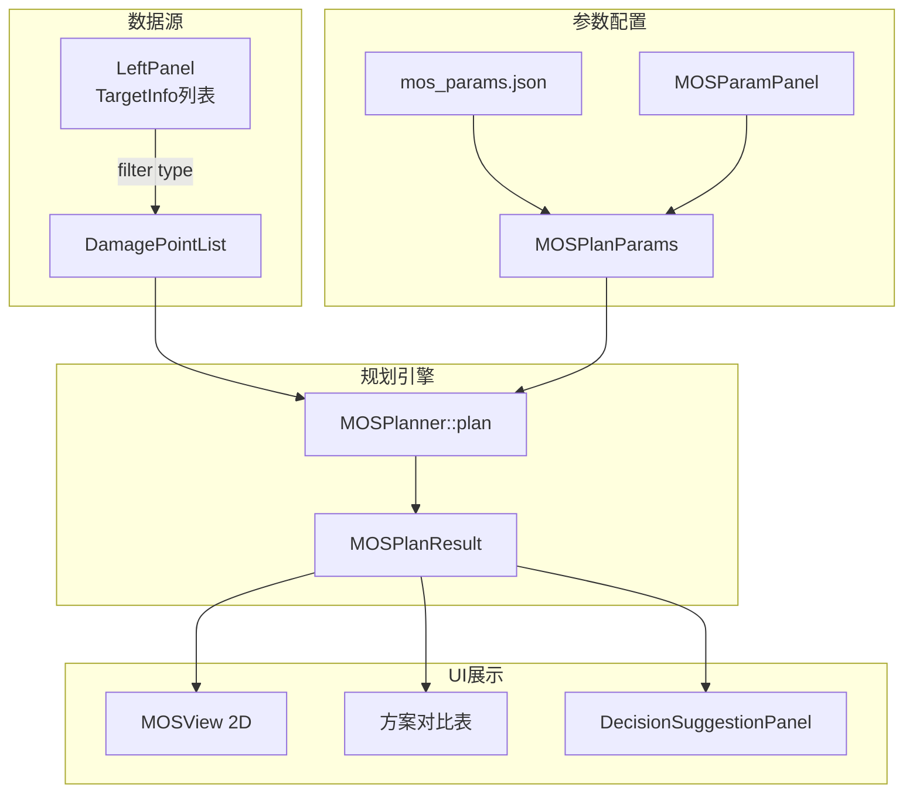
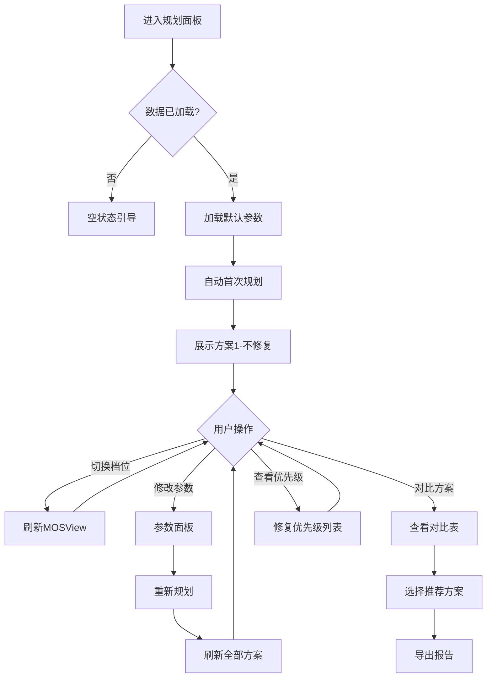

# MOS 产品设计文档：最小应急起降带规划

| 字段 | 值 |
|------|-----|
| **文档编号** | PD-MOS-001 |
| **版本** | V1.0 |
| **日期** | 2026-07-08 |
| **撰写人** | 产品经理 Alice |
| **项目** | UXO_v1 排弹抢修指挥系统 |
| **关联 PRD** | PRD-INC-UXO-001 V2.0（增量 PRD：未爆弹识别 + MOS 规划） |
| **技术栈** | Qt 5 / CMake / C++17 / QWidget + QPainter 自绘 |
| **范围说明** | 本文档**仅**覆盖 MOS（最小应急起降带规划）功能的产品设计。UXR（未爆弹识别）部分不动，参见 PRD-INC-UXO-001 |

---

## 1. 信息架构

### 1.1 MOS 功能在主窗口中的位置

MOS 功能通过**新增导航入口**接入现有 MainWindow 布局。现有布局结构为：

```
MainWindow
├── NavigationWidget (80px 固定宽)
├── LeftPanel (320px)
├── CenterArea (弹性)
│   ├── VideoStreamPanel
│   └── InfoArea
│       ├── AlertPanel
│       └── DetectionControlPanel
└── RightPanel (360-420px)
    ├── SituationView (Qt3D 3D 态势图)
    ├── DeviceStatusPanel
    └── DecisionSuggestionPanel
```

**变更方案**：

- NavigationWidget 新增第 7 个按钮 **"规划"**（图标建议：`✈` 或跑道俯视图标），位于"配置"按钮之前
- CenterArea 改为 **QStackedWidget**，将现有 VideoStreamPanel + InfoArea 封装为 page 0（`page_index=0`，"探测"导航对应），新增 MOS 面板为 page 1（`page_index=1`，"规划"导航对应）
- 导航信号 `navigationChanged(int pageIndex)` 驱动 QStackedWidget 切换

```
MainWindow（变更后）
├── NavigationWidget (80px)  ← 新增"规划"按钮 (page_index=1)
│   [态势] [探测] [决策] [设备] [统计] [规划] [配置]
│    0      1      2      3      4      5      6
├── LeftPanel (320px)        ← 不变
├── CenterArea (弹性)
│   └── QStackedWidget       ← 新增容器
│       ├── page[0]: 现有 VideoStreamPanel + InfoArea（"探测"）
│       └── page[1]: MOSPanel（"规划"）  ← 新增
└── RightPanel (360-420px)   ← 不变
    ├── SituationView (Qt3D)
    ├── DeviceStatusPanel
    └── DecisionSuggestionPanel  ← MOS 规划结果可推送至此
```

### 1.2 数据流转关系



**关键数据流说明**：

| 流向 | 数据 | 触发条件 |
|------|------|---------|
| LeftPanel → MOSPlanner | `DamagePoint[]`（type + position + impactRadius） | 进入"规划"面板时自动提取 |
| MOSParamPanel → MOSPlanner | `MOSPlanParams`（全部参数） | 用户点击"重新规划"或修改参数后自动触发 |
| MOSPlanner → MOSView | 当前档位的 `MOSScheme`（含 MOS 矩形 + 已修复点集） | 算法完成或档位切换 |
| MOSPlanner → 方案对比表 | 全部 `MOSScheme[]` | 算法完成 |
| MOSPlanner → DecisionSuggestionPanel | 推荐方案摘要（方案1~3 概览） | 算法完成，通过信号推送 |
| MOSView → 方案对比表 | 当前选中候选矩形（高亮） | 用户点击 MOS 候选矩形 |

---

## 2. 用户操作流程

### 2.1 完整操作流

```mermaid
flowchart TD
    A[进入"规划"面板] --> B{跑道与损毁数据<br/>是否已加载？}
    B -->|否| B1[显示空状态引导<br/>"请先在探测面板加载数据"]
    B -->|是| C[加载默认参数<br/>从 mos_params.json]
    C --> D[自动执行首次规划]
    D --> E[展示方案1<br/>不修复·最大可用起降带]

    E --> F{指挥员操作}

    F -->|查看方案2/3| G[点击档位切换控件<br/>QSlider 或 QComboBox]
    G --> H[刷新 MOSView 2D 视图<br/>显示对应档位 MOS 矩形]

    F -->|修改参数| I[在参数面板调整<br/>L_min/W_min/K/档位数等]
    I --> J[自动重新规划<br/>或点击"重新规划"按钮]
    J --> K[刷新全部方案 + 视图]

    F -->|对比方案| L[查看方案对比表<br/>面积/修复时间/难度/安全余量]
    L --> M{选择推荐方案}

    F -->|查看修复优先级| N[点击"修复优先级"标签页<br/>或查看方案详情]
    N --> O[显示排序后的损毁点列表<br/>标注已修复/待修复/优先级]

    M --> P[导出规划报告]

    H --> F
    K --> F
    O --> F
    P --> Q[操作完成]
```

### 2.2 关键交互节点说明

| 节点 | 用户意图 | 系统行为 |
|------|---------|---------|
| 进入"规划"面板 | 开始 MOS 分析 | 从 LeftPanel 提取 DamagePoint 列表，加载默认参数，自动执行首次规划 |
| 切换档位 | 查看不同修复程度下的起降带 | MOSView 即时刷新：重绘 MOS 矩形（位置可能变化）+ 更新已修复点标记 |
| 修改参数 | 调整任务需求 | 参数变更后自动触发重规划（debounce 300ms），或手动点击"重新规划" |
| 查看方案对比表 | 权衡"修多久"vs"起降能力" | 表格横向对比面积/修复时间/难度/安全余量 |
| 导出报告 | 保存规划结果 | 生成结构化文本，支持复制到剪贴板或保存为 .txt |

---

## 3. MOS 主面板布局设计

### 3.1 整体布局

采用 **QSplitter(V)** 上下分区，用户可拖拽调整比例：

```
┌──────────────────────────────────────────────────────────────────┐
│  模拟应急起降带规划 (MOS)               [⚙ 参数配置] [🔄 重新规划] [📋 导出报告] │
├──────────────────────────────────────────────────────────────────┤
│                                                                  │
│  ┌────────────────────────────────────────────────────────────┐  │
│  │                                                            │  │
│  │              MOSView (QWidget + QPainter)                  │  │
│  │              2D 跑道俯视图 · 约 60% 高度                    │  │  ← QSplitter(V)
│  │                                                            │  │     可拖拽
│  │  [图例] ● 弹坑  ○ UXO安全距离  ✓ 已修复  ▓ MOS矩形        │  │
│  │                                                            │  │
│  └────────────────────────────────────────────────────────────┘  │
│                                                                  │
│  ┌────────────────────────────────────────────────────────────┐  │
│  │  方案信息区 · 约 40% 高度                      档位: [1/3]▼│  │
│  │                                                            │  │
│  │  ┌───────────────────────┐  ┌────────────────────────────┐ │  │
│  │  │                       │  │                            │ │  │  ← QSplitter(H)
│  │  │   方案对比表           │  │  档位详情                  │ │  │     可拖拽
│  │  │   QTableWidget        │  │  · 修复进度: 3/8 → 优先级#5│ │  │
│  │  │                       │  │  · 累计修复时间: 12.5h     │ │  │
│  │  │   方案 | 修复点 | MOS │  │  · 综合难度: Medium        │ │  │
│  │  │   面积 | 时间 | 难度  │  │  · 已修复点列表            │ │  │
│  │  │                       │  │  · 安全余量: 23m           │ │  │
│  │  └───────────────────────┘  └────────────────────────────┘ │  │
│  └────────────────────────────────────────────────────────────┘  │
│                                                                  │
├──────────────────────────────────────────────────────────────────┤
│  状态栏：已找到 3 个递进方案 | 方案2 MOS 面积: 6,900m² | 模拟规划结果    │
└──────────────────────────────────────────────────────────────────┘
```

### 3.2 布局规格

| 区域 | 控件 | 说明 |
|------|------|------|
| 工具栏 | QToolBar | "参数配置"按钮、"重新规划"按钮、"导出报告"按钮 |
| 上方（~60%） | `MOSView`（QWidget 子类） | QPainter 自绘 2D 跑道俯视图，支持缩放/平移 |
| 下方·左（~60%） | `QTableWidget` | 递进方案对比表 |
| 下方·右（~40%） | `QWidget` 容器 | 档位切换控件 + 当前档位详情 |
| 状态栏 | `QStatusBar` | 规划状态摘要 |

---

## 4. 参数配置面板

### 4.1 参数清单

参数配置面板以 **QDialog**（模态弹窗）或 **QDockWidget**（可停靠面板）实现。所有默认值标注"示例值，待业务确认"。

| # | 参数名 | 控件类型 | 默认值 | 范围 | 可编辑 | 说明 |
|---|--------|---------|--------|------|--------|------|
| 1 | 最小起降长度 `L_min` | `QDoubleSpinBox` | 460 m | 100~3000 m | ✅ | 目标机型最小起飞滑跑/着陆滑跑长度（示例值，待业务确认） |
| 2 | 最小起降宽度 `W_min` | `QDoubleSpinBox` | 15 m | 5~500 m | ✅ | 目标机型翼展+安全边距（示例值，待业务确认） |
| 3 | 殉爆安全系数 `K` | `QDoubleSpinBox` | 1.5 | 0.5~5.0 | ✅ | UXO 安全距离公式 `D=K×W^(1/3)` 中的系数（示例值，待业务确认） |
| 4 | 弹坑扩展系数 | `QDoubleSpinBox` | 1.5 | 1.0~3.0 | ✅ | 弹坑影响半径 = 可见半径 × 扩展系数（示例值，待业务确认） |
| 5 | 递进档位数 | `QSpinBox` | 3 | 2~5 | ✅ | 递进方案生成数量（示例值，待业务确认） |
| 6 | 搜索范围·跑道长度 | `QDoubleSpinBox` | 3000 m | 100~5000 m | ✅ | MOS 搜索的跑道区域长度（默认 3000×50m 道面） |
| 7 | 搜索范围·跑道宽度 | `QDoubleSpinBox` | 50 m | 10~500 m | ✅ | MOS 搜索的跑道区域宽度（道面，非全宽 500m） |
| 8 | 释放面积增量权重 | `QDoubleSpinBox` | 0.70 | 0.00~1.00 | ✅ | 修复优先级排序权重1：修复后释放的可起降面积增量 |
| 9 | 离轴线距离权重 | `QDoubleSpinBox` | 0.30 | 0.00~1.00 | ✅ | 修复优先级排序权重2：离跑道中心轴线距离（权重1+权重2 应=1.0） |
| 10 | 弹坑回填速率 | `QDoubleSpinBox` | 50 m³/h | 1~500 m³/h | ✅ | 修复时间估算：弹坑体积÷回填速率（示例值，待业务确认） |
| 11 | UXO 排除基准工时 | `QDoubleSpinBox` | 8 h | 0.5~168 h | ✅ | 单个未爆弹排除的固定工时（示例值，待业务确认） |
| 12 | 候选排序数量 | `QSpinBox` | 3 | 1~10 | ✅ | 每个档位输出的 Top-N 候选 MOS 矩形（P0 默认3） |

**权重约束**：释放面积增量权重 + 离轴线距离权重 应始终 = 1.0，UI 可联动校验（修改一个时自动调整另一个）。

### 4.2 参数面板布局

```
┌──────────────────────────────────────────┐
│  MOS 规划参数配置                    [×] │
├──────────────────────────────────────────┤
│                                          │
│  目标机型起降要求                        │
│  最小长度: [  460 ] m   最小宽度: [ 15 ] m │
│                                          │
│  损毁影响半径                            │
│  殉爆安全系数 K: [ 1.5 ]               │
│  弹坑扩展系数:   [ 1.5 ]               │
│                                          │
│  跑道搜索范围                            │
│  跑道长度: [ 3000 ] m   跑道宽度: [ 50 ] m│
│                                          │
│  递进规划                                │
│  档位数: [ 3 ▼] (2~5)                   │
│  候选排序数: [ 3 ]  (每档 Top-N)         │
│                                          │
│  修复优先级权重 (应 = 1.0)               │
│  面积增量: [ 0.70 ]  离轴线: [ 0.30 ]    │
│                                          │
│  修复时间估算 (模拟估算)                 │
│  弹坑回填: [ 50 ] m³/h                  │
│  UXO 排除: [ 8 ] h/个                   │
│                                          │
│  ⚠ 以上默认值均为示例值，待业务确认      │
│                                          │
│         [恢复默认]  [取消]  [应用并重规划] │
└──────────────────────────────────────────┘
```

### 4.3 参数持久化

- 参数修改后自动保存到 `mos_params.json`（与现有配置文件同级目录）
- 下次启动时自动加载上次保存的参数
- "恢复默认"按钮将参数重置为硬编码默认值并覆盖 JSON

---

## 5. MOS 方案展示区设计

### 5.1 多方案对比表格结构

| 列名 | 数据来源 | 格式 | 说明 |
|------|---------|------|------|
| 方案编号 | `MOSScheme.tier` | "方案1(不修复)" / "方案2(修复部分)" / ... | 含修复程度描述 |
| 已修复点数 | `MOSScheme.repairedIds.size()` | "3/8" | 当前档位已修复数 / 总损毁点数 |
| MOS 起点坐标 | `MOSScheme.mos.origin` | "(x, y) m" | MOS 矩形左下角在跑道坐标系中的位置 |
| MOS 尺寸 | `MOSScheme.mos.length × width` | "460 × 15 m" | 起降带长×宽 |
| MOS 面积 | `MOSScheme.mos.area` | "6,900 m²" | 可用起降面积 |
| 累计修复时间 | `MOSScheme.cumulativeRepairTime` | "12.5 h（模拟估算）" | 本档位累计修复工时 |
| 修复难度 | `MOSScheme.maxDifficulty` | "低/中/高" + 颜色标识 | 本档位综合/最大难度 |
| 安全余量 | `MOSScheme.mos.safetyMargin` | "23 m" | MOS 矩形到最近未修复损毁点的影响圆边缘距离 |
| 是否满足约束 | `MOSScheme.valid` | ✅ / ❌ | 是否满足 L_min × W_min |

**表格呈现**：

```
┌──────┬──────────┬──────────────┬──────────────┬──────────┬────────────┬──────┬──────────┬──────┐
│ 方案 │ 已修复点  │ MOS 起点坐标  │ MOS 尺寸     │ MOS 面积  │ 修复时间    │ 难度 │ 安全余量  │ 约束 │
├──────┼──────────┼──────────────┼──────────────┼──────────┼────────────┼──────┼──────────┼──────┤
│ 1(不修复) │ 0/8  │ (120, 10)     │ 460 × 15 m   │ 6,900 m²  │ 0 h         │ —    │ 18 m      │ ✅   │
│ 2(修部分) │ 3/8  │ (200, 12)     │ 520 × 18 m   │ 9,360 m²  │ 14.2 h(模拟) │ 中   │ 25 m      │ ✅   │
│ 3(修更多) │ 5/8  │ (180, 15)     │ 580 × 20 m   │ 11,600 m² │ 30.5 h(模拟) │ 高   │ 32 m      │ ✅   │
└──────┴──────────┴──────────────┴──────────────┴──────────┴────────────┴──────┴──────────┴──────┘
```

### 5.2 档位切换控件

**方案 A（推荐 P0）**：`QComboBox` 下拉选择

```
档位: [方案1(不修复)             ▼]
      方案1(不修复)
      方案2(修复部分)
      方案3(修复更多)
```

**方案 B（P1 可选增强）**：`QSlider` + 标签

```
方案1 ◀══════════●══════════════▶ 方案3
       不修复      修复部分      修复更多
```

P0 优先实现 QComboBox（开发成本低），P1 可选 QSlider（视觉更直观，配合 MOS-009 步进展示）。

### 5.3 档位详情面板

```
┌─────────────────────────────────────┐
│  方案2 详情                         │
│                                     │
│  修复进度                           │
│  ████████████░░░░░░░░  3/8 个高影响点│
│  → 当前优先级: #5 (弹坑-3)          │
│                                     │
│  MOS 规格                           │
│  长度: 520 m    宽度: 18 m          │
│  面积: 9,360 m²  安全余量: 25 m     │
│                                     │
│  修复工程量（模拟估算）              │
│  累计时间: 14.2 h                   │
│  综合难度: 中                       │
│                                     │
│  已修复损毁点                       │
│  ✓ 弹坑-1 (已回填)                  │
│  ✓ UXO-2  (已排除)                  │
│  ✓ 弹坑-3 (已回填)                  │
│                                     │
│  待修复损毁点（按优先级排序）        │
│  #5 弹坑-4  影响面积: 420 m²  中    │
│  #7 UXO-5   影响面积: 180 m²  低    │
│  #8 弹坑-6  影响面积: 90 m²   低    │
└─────────────────────────────────────┘
```

---

## 6. MOSView 2D 绘制详细规格

### 6.1 图层顺序（从底到顶）

```
┌─────────────────────────────────────────────┐
│ Layer 7: 坐标标注 · 白字                     │  ← 顶层
├─────────────────────────────────────────────┤
│ Layer 6: MOS 候选矩形                        │
│   · 绿色半透明填充 (rgba 0,200,83,30%)       │
│   · 绿色实线边框 2px (#00C853)               │
│   · 矩形上标注：编号、起止坐标(m)、尺寸(m)   │
│   · 高亮态：蓝色边框 3px (#2979FF)           │
├─────────────────────────────────────────────┤
│ Layer 5: 已修复标记                          │
│   · 灰色 ✓ 符号 (#9E9E9E)                   │
│   · 损毁点影响圆变灰色虚线边框               │
├─────────────────────────────────────────────┤
│ Layer 4: UXO 安全距离影响圆                  │
│   · 黄色半透明填充 (rgba 255,235,59,25%)     │
│   · 黄色虚线边框 1px (#FFEB3B)               │
├─────────────────────────────────────────────┤
│ Layer 3: 弹坑影响圆                          │
│   · 红色半透明填充 (rgba 244,67,54,25%)     │
│   · 红色虚线边框 1px (#F44336)               │
├─────────────────────────────────────────────┤
│ Layer 2: 跑道轮廓                            │
│   · 灰色填充 (#424242)                       │
│   · 白色虚线边框 1px (#BDBDBD)               │
│   · 中线：白色点划线 (#BDBDBD, 0.5px)        │
├─────────────────────────────────────────────┤
│ Layer 1: 背景                                │
│   · 深灰 (#1E1E1E)                           │
└─────────────────────────────────────────────┘
```

### 6.2 颜色定义（暗色主题#1E1E1E）

| 元素 | 填充色 | 边框色 | 线宽 | 说明 |
|------|--------|--------|------|------|
| 背景 | `#1E1E1E` | — | — | 与主窗口暗色主题一致 |
| 跑道 | `#424242` | `#BDBDBD` 虚线 | 1px | 跑道轮廓，中线用点划线 |
| 弹坑影响圆 | `rgba(244,67,54,25%)` | `#F44336` 虚线 | 1px | 红色系，半透明 |
| UXO 安全距离圆 | `rgba(255,235,59,25%)` | `#FFEB3B` 虚线 | 1px | 黄色系，半透明 |
| 已修复标记 | — | `#9E9E9E` 虚线 | 1px | 影响圆变灰色，中心画 ✓ |
| MOS 矩形 | `rgba(0,200,83,30%)` | `#00C853` 实线 | 2px | 绿色系，半透明 |
| MOS 矩形(高亮) | `rgba(41,121,255,15%)` | `#2979FF` 实线 | 3px | 蓝色边框 |
| 坐标标注文字 | — | `#FFFFFF` | — | 白色，字体 10px monospace |
| 图例文字 | — | `#BDBDBD` | — | 浅灰色 |

### 6.3 缩放和平移行为

| 操作 | 行为 | 参数 |
|------|------|------|
| **滚轮向上** | 放大（以鼠标位置为中心） | 步进 +10%，最大 10× |
| **滚轮向下** | 缩小（以鼠标位置为中心） | 步进 -10%，最小 1× |
| **鼠标拖拽**（左键按住+移动） | 平移视图 | 无限制，允许拖出边界 |
| **双击空白区域** | 复位（1× 缩放 + 居中跑道） | 动画过渡 200ms（P0 瞬时亦可） |
| **`Ctrl` + 滚轮** | 微调缩放 | 步进 ±5% |

**缩放实现方式**：QPainter 的 `scale()` 变换，非 QGraphicsView（QWidget 自绘方案）。

**坐标系统**：
- 跑道坐标系：原点在跑道左下角，X 轴沿跑道长度方向（→），Y 轴沿宽度方向（↑）
- 视图坐标系：控件左上角 (0,0)，通过 `worldToView()` / `viewToWorld()` 转换

### 6.4 MOS 矩形标注内容

每个 MOS 候选矩形内部或上方标注：

```
┌─────────────────────────────┐
│  方案2 · MOS候选1            │  ← 编号
│  起点: (200, 12)             │  ← 左下角在跑道坐标系中的位置
│  尺寸: 520 × 18 m            │  ← 长 × 宽
│  面积: 9,360 m²              │  ← 面积
└─────────────────────────────┘
```

字体：`QFont("Consolas", 9)`，颜色 `#FFFFFF`，带半透明黑色背景框 `rgba(0,0,0,50%)`。

### 6.5 Tooltip 行为

鼠标悬停在损毁点影响圆上时，显示 tooltip：

```
弹坑-3
类型: 弹坑 (Crater)
可见半径: 5.2 m
影响半径: 7.8 m (×1.5)
状态: 未修复
─────────────────
UXO-2
类型: 未爆弹 (UXO)
当量估算: 22.0 kg TNT
影响半径: 4.3 m (D=1.5×22.0^(1/3))
状态: 已修复 ✓
```

实现方式：`QWidget::setMouseTracking(true)` + 重写 `mouseMoveEvent()`，在 `paintEvent` 中绘制悬浮提示框（或使用 `QToolTip::showText()`）。

### 6.6 图例

MOSView 右下角固定位置绘制图例：

```
┌─────────────────┐
│ ● 弹坑影响区     │
│ ○ UXO 安全距离   │
│ ✓ 已修复         │
│ ▓ MOS 起降带     │
│ ▓▓ 高亮选中      │
└─────────────────┘
```

---

## 7. 空状态和错误状态

### 7.1 无可用起降带

当算法返回 `MOSPlanResult.schemes` 中方案1（不修复档位）的 `MOSScheme.valid == false` 时：

**2D 视图显示**：
- 背景仍绘制跑道轮廓和所有损毁点
- 跑道区域中央显示红色警告文字：

```
⚠ 当前参数下无可用起降带

原因：最小起降长度要求 460m，跑道可用的最大连续空区域仅 320m。
建议：
  1. 放宽最小起降尺寸要求（当前 L_min=460m, W_min=15m）
  2. 考虑修复部分损毁点后重规划（查看方案2/3）
  3. 检查损毁点数据是否完整

[修改参数] [查看方案2]
```

- 颜色：警告图标 `#FF5252`，文字 `#FFCDD2`，建议文字 `#BDBDBD`

### 7.2 参数非法时的错误提示

| 场景 | 提示方式 | 提示内容 |
|------|---------|---------|
| `L_min > 跑道长度` | 内联提示（参数面板红色边框 + tooltip） | "最小起降长度不能超过跑道长度 (3000m)" |
| `W_min > 跑道宽度` | 内联提示 | "最小起降宽度不能超过跑道宽度 (50m)" |
| 档位数 < 2 或 > 5 | 内联提示 | "档位数须在 2~5 之间" |
| 权重之和 ≠ 1.0 | 内联提示 + 黄色 warning | "面积增量权重与离轴线距离权重之和应为 1.0"（自动修正可选） |
| 弹坑回填速率 ≤ 0 | 内联提示 | "回填速率须大于 0" |

非法参数时，"应用并重规划"按钮置灰不可点击。所有错误在参数面板内联显示，不使用模态弹窗（避免打断用户当前操作）。

### 7.3 首次进入（无数据）引导状态

当用户首次进入"规划"面板且 LeftPanel 中无弹坑/UXO 类型目标时：

```
┌──────────────────────────────────────────┐
│                                          │
│           🛫  应急起降带规划              │
│                                          │
│     当前无弹坑/未爆弹损毁数据。           │
│     请先在"探测"面板加载场景数据，        │
│     或导入模拟损毁点配置。                │
│                                          │
│         [前往探测面板]  [加载模拟数据]     │
│                                          │
└──────────────────────────────────────────┘
```

"前往探测面板"按钮通过信号切换到 NavigationWidget 的"探测"页。

---

## 8. 与现有系统的衔接

### 8.1 损毁点数据来源

MOS 损毁点从 LeftPanel 目标列表提取，构建流程：

```
LeftPanel::TargetList (QList<TargetInfo>)
    │
    ├── filter: type == Crater || type == UXO
    │
    ├── map: TargetInfo → DamagePoint
    │     ├── position   = TargetInfo.localPosition (跑道坐标系)
    │     ├── type       = Crater | UXO
    │     ├── impactRadius = 弹坑: visibleRadius × craterExpandFactor
    │     │                  UXO:   K × yieldEstimate.nominalYield^(1/3)
    │     ├── id         = TargetInfo.id
    │     └── source     = "模拟" / "传感器"
    │
    └── DamagePointList
```

**关键约束**：

- MOS 算法**只消费** `DamagePoint.impactRadius` 字段，不读取 `YieldEstimate` 也不计算殉爆公式——殉爆公式的计算在构建 DamagePoint 时由外部完成
- `yieldEstimate` 的变化（如人工修正当量）会触发 DamagePoint 的 `impactRadius` 重新计算，进而触发 MOS 重规划
- `impactRadius` 可由人工在参数面板临时覆盖（不影响原始 TargetInfo 数据）

### 8.2 规划结果回传 DecisionSuggestionPanel

MOS 规划完成后，通过 Qt 信号将推荐方案摘要推送至 RightPanel 的 DecisionSuggestionPanel：

```cpp
// 信号声明（在 MOSPlanner 或 MOSPanel 中）
signals:
    void mosPlanCompleted(const MOSPlanSummary& summary);

// MOSPlanSummary 结构
struct MOSPlanSummary {
    int totalSchemes;         // 总方案数
    bool hasValidScheme;      // 是否存在至少一个有效方案
    QString recommendedScheme; // "方案1(不修复)" / "方案2(修复部分)" 等
    double recommendedArea;    // 推荐方案面积 (m²)
    double recommendedRepairTime; // 推荐方案修复时间 (h)
    QString briefReason;       // 推荐理由摘要
};
```

DecisionSuggestionPanel 接收后在对应区块展示：

```
┌─────────────────────────────────┐
│  📋 决策建议                     │
│                                  │
│  MOS 规划建议                    │
│  推荐方案: 方案2 (修复部分)       │
│  可用起降带: 520 × 18 m          │
│  修复时间: 约 14.2 h（模拟估算）  │
│  理由: 修复3个高影响点后起降带    │
│  面积增加 36%，性价比最优         │
│  [查看完整规划]                  │
└─────────────────────────────────┘
```

### 8.3 与现有 NavigationWidget 的集成

```
NavigationWidget 现有 6 按钮:
  态势(0) / 探测(1) / 决策(2) / 设备(3) / 统计(4) / 配置(5)

新增后变为 7 按钮:
  态势(0) / 探测(1) / 决策(2) / 设备(3) / 统计(4) / 规划(5) / 配置(6)

CenterArea 改造：
  QStackedWidget
    page[0] = 现有 VideoStreamPanel + InfoArea（"探测"对应）
    page[1] = MOSPanel（"规划"对应）

信号链路：
  NavigationWidget::navigationChanged(int index)
    → MainWindow::onNavigationChanged(index)  ← 现有空槽位，需填入实现
      → QStackedWidget::setCurrentIndex( index == 5 ? 1 : 0 )
```

---

## 9. 交互细节补充

### 9.1 点击 MOS 候选矩形高亮

| 触发条件 | 行为 |
|---------|------|
| 鼠标左键点击 MOS 矩形内部 | 该矩形高亮（蓝色边框 3px `#2979FF`），方案对比表中对应行同步高亮 |
| 点击 MOS 矩形外部空白区域 | 取消高亮（恢复绿色边框），对比表取消选中 |
| 方案对比表中点击某行 | MOSView 中对应矩形同步高亮，必要时自动平移视图使矩形可见 |

高亮状态通过 `selectedSchemeIndex` 成员变量维护，重绘时判断绘制蓝色边框。

### 9.2 方案切换行为

| 场景 | 过渡效果 |
|------|---------|
| QComboBox 切换档位 | **瞬时切换**（P0）。MOSView 立即重绘为新档位的 MOS 矩形 + 已修复点标记。方案对比表保持不动 |
| "重新规划"按钮 | 显示短暂 loading 状态（工具栏按钮文字变 "规划中..." + 禁用），完成后刷新所有区域。P0 用瞬时刷新，P1 可加 fade 过渡（200ms） |

**P0 不要求动画过渡**——瞬时重绘即可满足 MVP 需求。P1 可选：

- MOS 矩形位置变更时：旧矩形 200ms 淡出 → 新矩形 200ms 淡入
- 已修复标记更新时：影响圆从红色→灰色 300ms 颜色过渡

### 9.3 "重新规划"按钮行为

```
用户点击 [重新规划]
    │
    ├── 从参数面板读取最新 MOSPlanParams
    ├── 从 LeftPanel 重新提取 DamagePointList（含最新的 impactRadius）
    ├── 调用 MOSPlanner::plan(runway, damagePoints, params)
    ├── 收到 MOSPlanResult
    ├── 重置档位选择为 方案1
    ├── 刷新 MOSView（绘制方案1的 MOS）
    ├── 刷新方案对比表（填充全部方案）
    └── 发送 mosPlanCompleted 信号 → DecisionSuggestionPanel
```

**关键**：先提取数据再计算，"重新规划"始终重新调用完整算法，而非仅刷新参数。

### 9.4 快捷键

| 快捷键 | 功能 |
|--------|------|
| `Ctrl+R` | 重新规划 |
| `Ctrl+1/2/3` | 切换到方案1/2/3 |
| `Ctrl+0` | 视图复位（1× + 居中） |
| `F1` | 打开参数配置面板 |
| `+/-` | 缩放 |

---

## 10. 优先级与分期交付建议

### 10.1 P0 — 两周必须交付

| # | 需求 | 对应 PRD 编号 | 核心交付物 | 估算（人天） |
|---|------|-------------|-----------|:-----------:|
| 1 | 跑道与损毁模型 | MOS-001 | `RunwayModel` + `DamagePoint` 数据结构 + JSON 加载 | 2 |
| 2 | 窗口扫描法（平行 + 斜向枚举） | MOS-002 | 完整 MOS 搜索算法，含平行优先 + ±5°斜向枚举 + 碰撞检测 | 5 |
| 3 | 多方案递进框架 | MOS-003 | 2~5 档位可变、每档按优先级截断重算 MOS、单调性验证 | 4 |
| 4 | 修复优先级排序 | MOS-004 | 加权排序（面积增量 70% + 离轴线 30%）、权重可配置 | 3 |
| 5 | 修复时间/难度估算 | MOS-005 | 弹坑体积÷回填速率 + UXO 固定工时，标注"模拟估算" | 3 |
| 6 | MOS 参数配置 | MOS-006 | 参数面板（12 个参数）+ JSON 持久化 | 2 |
| 7 | **2D MOSView 绘制** | MOS-007 | QWidget + QPainter 自绘 7 层图层 + 缩放/平移/复位 + tooltip | 3 |
| 8 | NavigationWidget 集成 | 新增 | "规划"按钮 + QStackedWidget + 导航信号连接 | 1 |
| 9 | 方案对比表 + 档位切换 | 新增 | QComboBox + QTableWidget + 档位详情面板 | 2 |
| 10 | 空状态 & 错误状态 | 新增 | 无数据引导 + 无可用起降带警告 + 参数校验 | 1 |
| | **P0 合计** | | | **26 人天** |

> P0 合计 26 人天 vs PRD 原估 22 人天，差额来自：文档新增的窗口扫描法斜向枚举复杂度（+2d）、完整的 2D View 自绘基础设施（+1d）、NavigationWidget 集成（+1d）。

### 10.2 P1 — 后续迭代

| # | 需求 | 对应 PRD 编号 | 核心交付物 | 估算（人天） |
|---|------|-------------|-----------|:-----------:|
| 1 | 多方案可视化对比 | MOS-008 | 同一跑道叠加全部方案 MOS 框 + 变化趋势标注 | 5 |
| 2 | 滑块步进展示 | MOS-009 | QSlider 档位切换 + 实时刷新修复进度与选址变化 | 3 |
| 3 | Top-3 候选排序 | MOS-010 | 档位内多候选 + 面积降序 + 安全余量过滤 | 3 |
| 4 | MOS 人工微调 | MOS-011 | 四边/四角拖拽 + 实时碰撞检测 + 约束验证 | 3 |
| 5 | 规划报告 | MOS-012 | 结构化文本报告 + 剪贴板/文件导出 | 2 |
| 6 | DecisionSuggestionPanel 集成 | 新增 | MOS 推荐方案摘要推送 RightPanel | 1 |
| 7 | FAHP/TOPSIS 多准则优选 | 新增 | 替代简单面积排序的多准则候选优选 | 3 |
| | **P1 合计** | | | **20 人天** |

### 10.3 P2 — 远期规划

| # | 需求 | 说明 |
|---|------|------|
| 1 | MOS-013 3D 可视化 | 在 SituationView Qt3D 中渲染 MOS 矩形 |
| 2 | MOS-014 动态重规划 | 损毁点变化时自动触发 |
| 3 | 碰撞检测精确算法 | Aggarwal/Suri 精确最大空矩形替代栅格扫描 |
| 4 | 元启发式搜索 | 遗传算法/粒子群优化，替代窗口扫描法 |
| 5 | 动画过渡 | MOS 矩形移动/缩放动画 + 颜色渐变 |

### 10.4 P0 两周里程碑分解

| 周次 | 里程碑 | 产出 |
|------|--------|------|
| **第 1 周** | 算法可用 | MOS-001~005 完成：跑道模型 + 损毁模型 + 窗口扫描法 + 递进框架 + 修复优先级 + 时间估算，所有算法单元测试通过 |
| **第 2 周** | UI 闭环 | MOS-006~007 + 集成：参数面板 + 2D MOSView + NavigationWidget 集成 + 方案对比表 + 空状态处理，端到端可演示 |

---

## 附录 A：2D 绘制基础设施从零搭建清单

当前系统无任何 `paintEvent` 重写，2D 绘制基础设施为零。MOSView 需要从零搭建以下基础设施：

| # | 基础设施项 | 说明 |
|---|-----------|------|
| 1 | `MOSView` 类 | 继承 `QWidget`，重写 `paintEvent`、`mousePressEvent`、`mouseMoveEvent`、`mouseReleaseEvent`、`wheelEvent`、`mouseDoubleClickEvent` |
| 2 | 视口变换 | `worldToView(QPointF)` / `viewToWorld(QPoint)` / `zoomLevel` / `panOffset` 成员 |
| 3 | 缩放控制 | `setZoom(qreal level)`，范围 1.0~10.0，以鼠标位置为中心缩放 |
| 4 | 平移控制 | 拖拽偏移量 `panOffset`，左键按下+移动更新 |
| 5 | 绘制基类/工具函数 | `drawRunway()`, `drawDamageCircle()`, `drawMOSRect()`, `drawLabel()` 等分离的绘制函数 |
| 6 | 选中状态管理 | `selectedSchemeIndex` / `selectedCandidateIndex`，驱动高亮绘制 |
| 7 | Tooltip 管理 | `hoveredDamageIndex`，在 `mouseMoveEvent` 中更新，`paintEvent` 中绘制 tooltip |

---

## 附录 B：Mermaid 源码 · 数据流转图



## 附录 C：Mermaid 源码 · 用户操作流程图



---

**文档结束**
